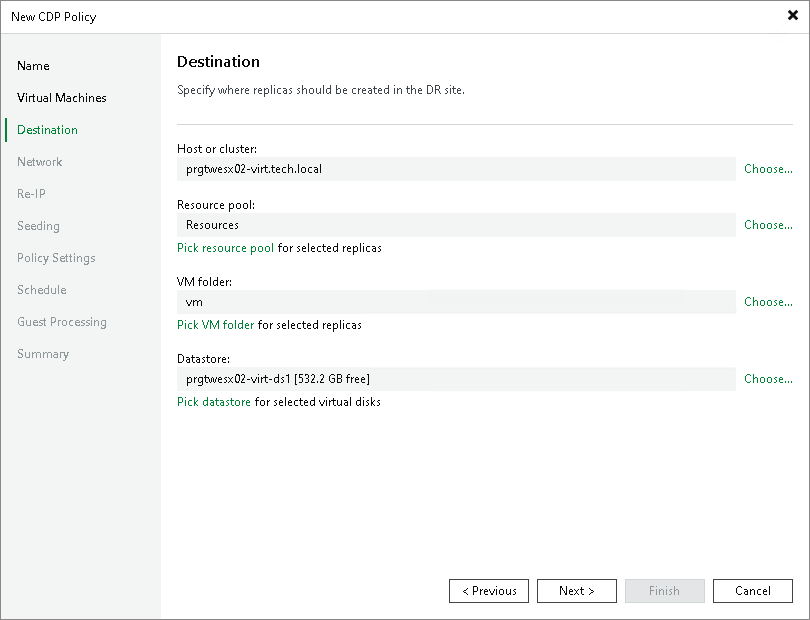

# Step 6. Select Replica Destination

At the Destination step of the wizard, select a target host or cluster, resource pool, folder and datastore for replicas, and types of replica disks:

1. Next to the Host or cluster field, click Choose and select a host or cluster where replicas must be registered. If you select a cluster or vCenter Server, the replication process will become more sustainable — the replication process will not fail if there is at least one available host in the cluster.

If you select a cluster as a destination, Veeam Backup & Replication will request VMware to send the list of available hosts, and will select the first host in this list as the destination for the replicas. These replicas will be stored on the datastore with the most free disk space.

1. Next to the Resource pool field, click Choose and select a resource pool to which replicas will be added.

If you have selected to replicate multiple VMs and want to add individual replicas to other resource pools:

1. Click the Pick resource pool for selected replicas link.
2. In the Choose Resource Pool window, click Add VM.
3. In the Add Objects window, select the necessary VMs and click Add.
4. In the Choose Resource Pool window, select the necessary VMs in the Replica VM resource pool list. At the bottom of the window, click Resource Pool.
5. In the Select Resource Pool window, select the necessary resource pool and click OK.

1. Next to the VM folder field, click Choose and select a folder where all VM files will be stored. Note that the VM folder section is disabled if you have selected a standalone ESXi host as the target for replicas.

If you have selected to replicate multiple VMs and want to place individual replicas to other folders:

1. Click the Pick VM folder for selected replicas link.
2. In the Choose Folder window, click Add VM.
3. In the Add Objects window, select the necessary VMs and click Add.
4. In the Choose Folder window, select the necessary VMs in the Replica VM folder list. At the bottom of the window, click VM Folder.
5. In the Select Folder window, select the necessary folder.

1. Next to the Datastore field, click Choose and select a datastore where replica files will be stored. Note that if you have chosen to replicate VMs to a cluster, Veeam Backup & Replication displays only shared datastores.

If you have selected to replicate multiple VMs and want to place individual replicas to other datastores:

1. Click the Pick datastore for selected virtual disks link.
2. In the Choose VM Files Location window, click Add VM.
3. In the Add Objects window, select the necessary VMs and click Add.
4. In the Choose VM Files Location window, select the necessary VMs in the Files location list. At the bottom of the window, click Datastore.
5. In the Select Datastore window, select the necessary datastore.

1. If you want to store replica configuration files and disk files in different datastores:

1. Click the Pick datastore for selected virtual disks link.
2. In the Choose VM Files Location window, click Add VM.
3. In the Add Objects window, select the necessary VMs and click Add.
4. In the Choose VM Files Location window, expand the necessary VMs in the Files location list, and select the necessary files. At the bottom of the window, click Datastore.
5. In the Select Datastore window, select the destination for the selected type of files.

1. You can change types of replica disks. By default, Veeam Backup & Replication saves disks in the thin type.

To change replica disk types:

1. Click the Pick datastore for selected virtual disks link.
2. In the Choose VM Files Location window, click Add VM.
3. In the Add Objects window, select VMs whose disk type you want to change and click Add.
4. In the Choose VM Files Location window, select the necessary VMs in the Files location list. At the bottom of the window, click Disk type.
5. In the Disk Type Settings window, select a type that will be used to restore replica disk files: same as source, thin, thick lazy zeroed or thick eager zeroed.

For more information about disk types, see [VMware Docs](https://docs.vmware.com/en/VMware-vSphere/7.0/com.vmware.vsphere.vm_admin.doc/GUID-4C0F4D73-82F2-4B81-8AA7-1DD752A8A5AC.html).

|  |
| --- |
| Note |
| Disk type change is available only for VMs that use virtual hardware version 7 or later. |

