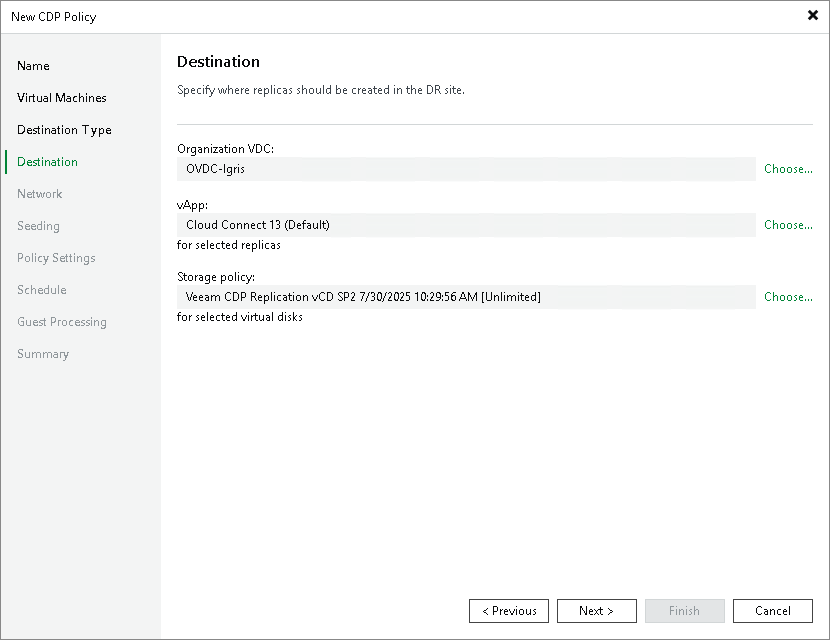

# Cloud Host Settings

At the Destination step of the wizard, specify the destination and resources allocated by the service provider (SP):

1. In the Host or cluster section, click Choose. Then select the cloud host allocated to you by the SP:

* If the SP allocated to you replication resources on a VMware vSphere host, select the cloud host provided to you through a hardware plan.
* If the SP allocated to you replication resources in VMware Cloud Director, select the cloud host provided to you through an organization VDC.

|  |
| --- |
| Note |
| After you select an organization VDC, the name of the Host or cluster section will change to Organization VDC. |

1. Select storage resources allocated to you by the SP:

* [For a CDP policy targeted at VMware vSphere] To specify a datastore on which to store replicas, in the Datastore section, click Choose and select the necessary datastore.
* [For a CDP policy targeted at VMware Cloud Director] To specify a vApp or storage policy for VM replicas, in the vApp and Storage policy sections, click Choose and select the necessary resources.

Note that you must not use the same vApp as a target for both a CDP policy and a snapshot-based replication job.

|  |
| --- |
| Note |
| After the CDP policy is performed for the first time, you will not be able to change the target host for this CDP policy. |

Page updated 2026-06-25

