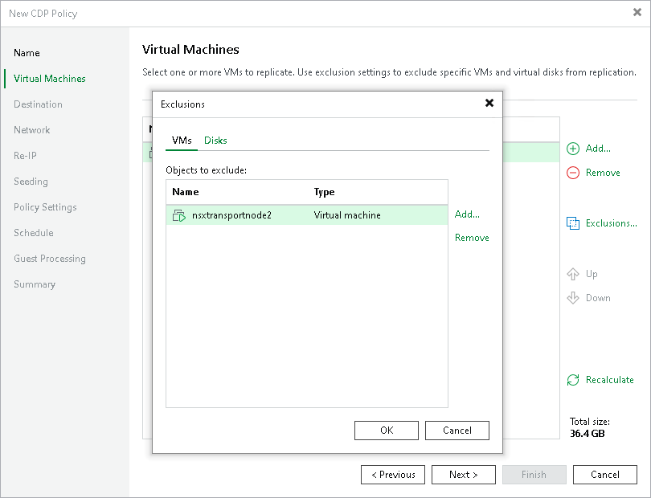
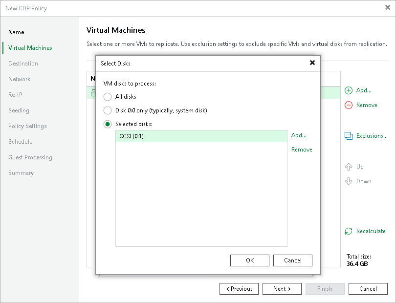

# Step 4. Exclude Objects

In this article

After you have added VMs or VM containers to the CDP policy, you can specify which objects you want to exclude from being replicated.

Excluding VMs or VM Containers

To exclude VMs from a VM container:

1. At the Virtual Machines step of the wizard, click Exclusions.
2. In the Exclusions window, check that the VMs tab is selected and click Add.
3. In the Add Objects window, select VMs or VM containers that you want to exclude from being replicated and click Add.

You can use the toolbar at the top right corner of the window to switch between views. Depending on the view you select, some objects may not be available. For example, if you select Tags combination view, no resource pools, hosts or clusters will be displayed in the tree. In the Tags combination view, you can select multiple tags and only those VMs that have all the selected tags will be excluded from the policy.

You can also use the Show full hierarchy check box to display the hierarchy of all VMware Servers added to the Veeam Backup & Replication infrastructure.

1. Click OK.

Excluding Disks

To exclude VM disks:

1. At the Virtual Machines step of the wizard, click Exclusions.
2. In the Exclusions window, do the following:

1. Switch to the Disks tab.
2. If you want to exclude disks of VMs that are added as a part of containers, click Add. In the Add Objects window, select the necessary VMs and click Add. Veeam Backup & Replication will include these VMs in the list as standalone objects.
3. In the Disks to process list, select VMs or VM containers whose disks you want to exclude.
4. Click Edit.

1. In the Select Disks window, select disks that you want to replicate: all disks, 0:0 disks (as a rule, system disks) or specific IDE, SCSI, SATA or NVMe disks. Disks that you do not select will be excluded from processing. Click OK.
2. In the Exclusions window, click OK.

|  |
| --- |
| Note |
| If you exclude disks from being replicated and [enable application-aware processing](replica_vss_vm.md), Veeam Backup & Replication will still perform application-aware processing for the excluded disks. This means that VSS will process disk data. |

Page updated 8/20/2025

Page content applies to build 13.0.1.1071
