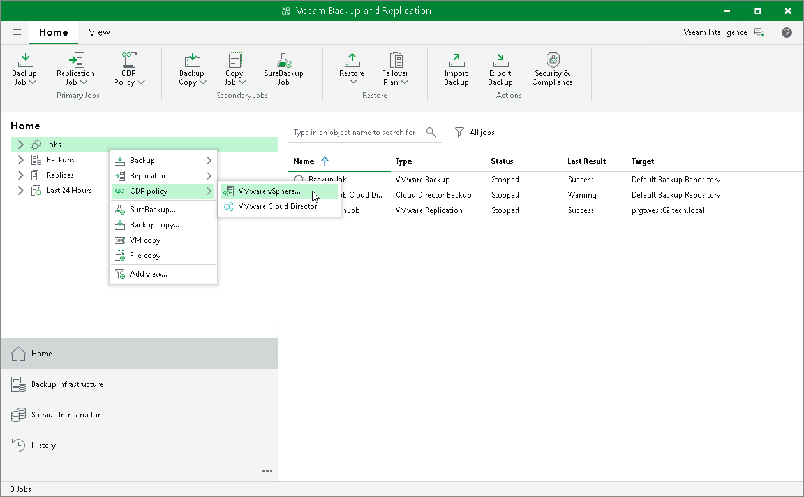

# Step 1. Launch New CDP Policy Wizard

To launch the New CDP Policy wizard, do one of the following:

* Open the Home view. On the ribbon, click CDP Policy > VMware vSphere.
* Open the Home view. In the inventory pane, right-click Jobs and select CDP Policy > VMware vSphere.

* Open the Inventory view. In the working area, right-click VMs that you want to replicate. Select Add to CDP policy > New job if you want to create a new CDP policy, or Add to CDP policy > <Policy Name> if you want to add VMs to an existing CDP policy.

