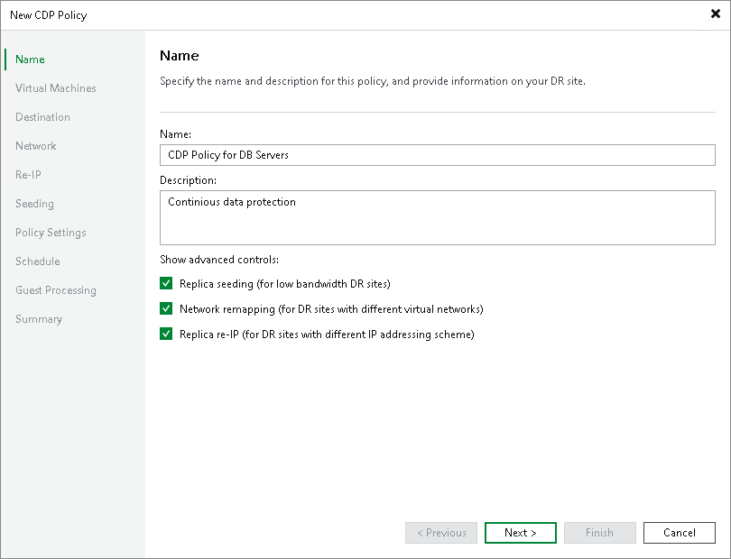

# Step 2. Specify Policy Name and Advanced Settings

At the Name step of the wizard, specify a name and description for the CDP policy.

Related Topics

[Replica Seeding and Mapping](cdp_seeding.md)

Page updated 2026-06-25

