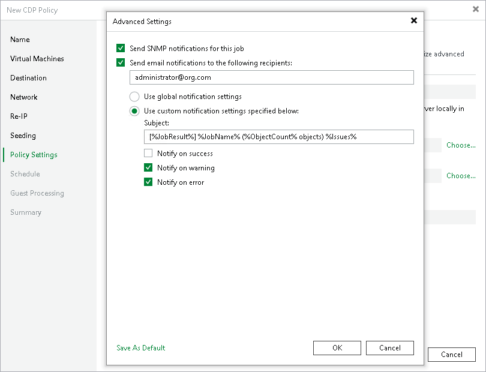

# Step 11. Specify Notification Settings

Veeam Backup & Replication can send by email two types of notifications for CDP policies: session reports and RPO reports.

Veeam Backup & Replication sends session reports after a CDP policy session stops. This report includes information on the policy during the session, for example read and transferred data. The session report is configured using the [Global Email Notification Settings](general_email_notifications.md). Veeam Backup & Replication sends RPO reports after the configured RPO period ends. This report contains information on the maximum delay, SLA and other information. The RPO report is configured at the Policy Settings step of the wizard.

At the Policy Settings step of the wizard, specify RPO notification settings:

1. At the lower right corner, click Use the advanced policy settings to configure notification options.
2. To receive SNMP traps on the CDP policy, select the Send SNMP notifications for this job check box.

SNMP traps will be sent if you configure global SNMP settings in Veeam Backup & Replication and configure software on recipient machine to receive SNMP traps. For more information, see [Specifying SNMP Settings](snmp_settings.md).

1. To receive notifications by email in case of policy failure, success or warning, select the Send email notifications to the following recipients check box. Then configure notification settings:

1. Check that you have configured global email notification settings as described in section [Configuring Global Email Notification Settings](general_email_notifications.md).
2. In the text field, specify a recipient email address. If you want to specify multiple addresses, separate them by a semicolon.
3. To use global notification settings, select Use global notification settings.
4. To specify a custom notification subject and redefine at which time notifications must be sent, select Use custom notification settings specified below. Then specify the following settings:

1. In the Subject field, specify a notification subject. You can use the following variables in the subject: %JobResult%, %JobName%, %ObjectCount% (number of workloads in the policy) and %Issues% (number of workloads in the policy that have been processed with the Warning or Failed status).
2. Select the Notify on success, Notify on error or Notify on warning check boxes to receive email notification if the policy gets the Warning, Success of Error status.

|  |
| --- |
| Note |
| A CDP policy will get the Warning or Error status according to the reporting settings configured at the Schedule step of the wizard. The policy will get the Success status after the initial configuration succeeds and every day at 8 A.M. if no error or warning occurs. |

