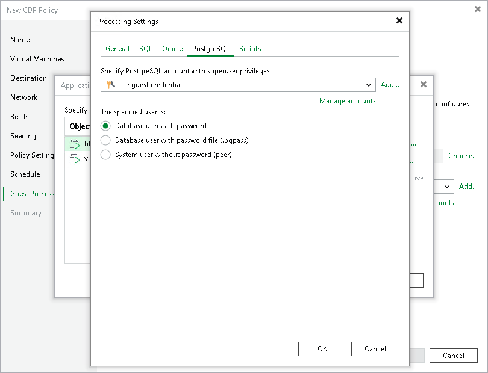

# PostgreSQL Settings

In this article

The PostgreSQL tab applies to Linux VMs that run PostgreSQL.

To create transactionally consistent backups of a PostgreSQL VM, you must check that application-aware processing is enabled and then specify settings of WAL files processing.

Enabling Application-Aware Processing

Before configuring WAL files processing, check that application-aware processing is enabled:

1. At the Guest Processing step of the wizard, select the Enable application-aware processing check box.
2. Click Application handling options for individual machiness.
3. In the displayed list, select the PostgreSQL VM and click Edit.

To define custom settings for a VM added as a part of a VM container, you must include the VM in the list as a standalone object. To do this, click Add and choose the necessary VM. Then select the VM in the list and define the necessary settings.

1. In the Processing Settings window, on the General tab, check that Require successful processing or Try application processing, but ignore failures option is selected in the Applications area.

|  |
| --- |
| Note |
| By default, Veeam Backup & Replication recursively scans the /etc/postgresql, /var/lib/postgresql and /var/lib/pgsql directories for the configuration files of PostgreSQL instances. If you keep configuration files in custom directories, the pgsqlagent agent will use its own VeeamPostgreSQLAgent.xml configuration file that is located in the /etc/veeam/ directory. The pgsqlagent agent configuration file must be a single line XML.  To explicitly include or exclude specific configuration files from rescan, you can add the following commands to the VeeamPostgreSQLAgent.xml file:   * ExcludeConfigDirs — use this element to exclude configuration files. * AddConfigDirs — use this element to include configuration files.   For example: <config AddConfigDirs="/opt/psql/" ExcludeConfigDirs="/var/lib/postgresql/13/main45/,/var/lib/postgresql/13/maindd/" /> |

Specifying WAL Files Settings

To define how Veeam Backup & Replication will process WAL files on this VM, do the following:

1. In the Processing Settings window, click the PostgreSQL tab.
2. From the Specify PostgreSQL account with superuser privileges drop-down list, select a user account that Veeam Backup & Replication will use to connect to the PostgreSQL instance. The account must have privileges described in section [Permissions](required_permissions.md#postgresql). You can select Use guest credentials from the list of user accounts. In this case, Veeam Backup & Replication will use the account specified at the Guest Processing step of the wizard to access the VM guest OS and connect to the PostgreSQL instance.

If you have not set up credentials beforehand, click the Manage accounts link or click the Add button to add credentials. Note that if you select the System user without password file (peer) option in the The specified user is area, you can add a user account without specifying a password.

1. In the The specified user is section, specify how the user selected in the Specify PostgreSQL account with superuser privileges drop-down list will authenticate against the PostgreSQL instance:

* Select Database user with password if the account is a PostgreSQL account, and you entered the password for this account in the Credentials Manager.

|  |
| --- |
| Note |
| If you want Veeam Backup & Replication to use the user name map authentication, select Database user with password and leave the password field empty. Consider the following:   * Guest OS credentials specified at the Guest Processing step of the wizard will be used as the System-Username.  * PostgreSQL account specified at the step 2 will be used as the PG-Username.   For more information about the user name maps, see [PostgreSQL documentation](https://www.postgresql.org/docs/current/auth-username-maps.html). |

* Select Database user with password file (.pgpass) if the password for the account is defined in the .pgpass configuration file on the PostgreSQL server. For more information about the password file, see [PostgreSQL documentation](https://www.postgresql.org/docs/current/libpq-pgpass.html).
* Select System user without password file (peer) if you want Veeam Backup & Replication to use the peer authentication method. In this case, Veeam Backup & Replication will apply the OS account as the PostgreSQL account.

|  |
| --- |
| Important |
| If you have added a new PostgreSQL account and want to use it with the peer authentication method, make sure that you have added this account as a Linux user with [sufficient permissions](required_permissions.md#postgresql). |

Page updated 8/20/2025

Page content applies to build 13.0.1.1071
