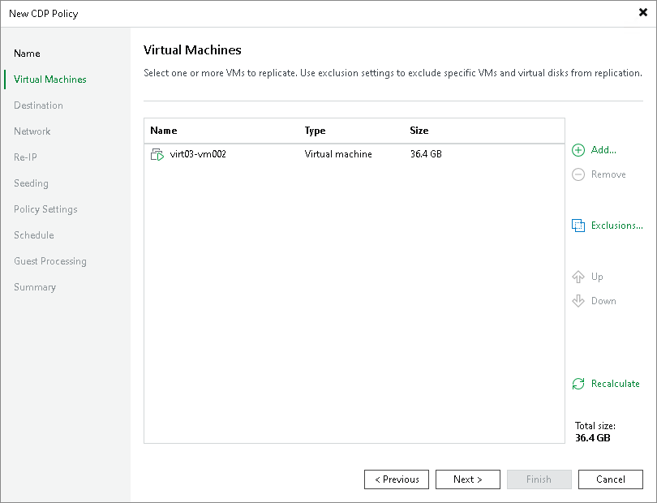

# Step 3. Select VMs to Replicate

In this article

At the Virtual Machines step of the wizard, select VMs or VM containers that you want to replicate:

1. Click Add.
2. In the Add Object window, select the necessary VMs or VM containers and click Add.

If you select VM containers (hosts, clusters, folders, resource pools, VirtualApps or datastores) and add new VMs to this container in future, Veeam Backup & Replication will update CDP policy settings automatically to include these VMs.

|  |
| --- |
| Note |
| Even if you add VM containers to a CDP policy, only VMs are replicated. VM templates, VM logs, folders and so on are not replicated. |

You can use the toolbar at the top right corner of the window to switch between views. Depending on the view you select, some objects may not be available. For example, if you select Tags combination view, no resource pools, hosts or clusters will be displayed in the tree. In the Tags combination view, you can select multiple tags and only those VMs that have all the selected tags will be processed by the policy.

|  |
| --- |
| Important |
| Consider the following:   * You can replicate only VMs that are turned on, the turned off VMs will be skipped from processing. * You cannot add to a CDP policy VMs that were already added to other CDP policies created on the same backup server. |

To quickly find the necessary VMs, you can use the search field at the bottom of the Add Object window. If you want to switch between types of VMs you want to search through, use the button to the left of the search field.

Page updated 1/25/2024

Page content applies to build 13.0.1.1071
