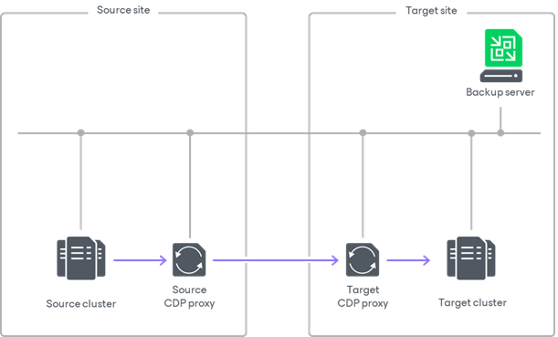

# CDP Proxies

A CDP proxy is a component that operates as a data mover and transfers data between the source and target hosts. Basically, CDP proxy performs the following tasks:

* Receives VM data from the production storage
* Aggregates changed data
* Prepares data for short-term restore points
* Compresses and deduplicates data
* Encrypts and decrypts data
* Sends data to the storage in the disaster recovery site or another CDP proxy

Usage Scenarios

A CDP proxy is required for continuous data protection. For more information on the backup infrastructure components required for CDP, see [Continuous Data Protection (CDP) for VMware vSphere](cdp_replication.md).

CDP Proxy Deployment

You can assign the role of a CDP proxy to any Windows-based or Linux-based virtual or physical server added to your Veeam Backup & Replication infrastructure. For information on how to add a server, see [Adding Microsoft Windows Servers](add_windows_server.md) and [Adding Linux Servers](add_linux_server.md). For information on how to assign the CDP proxy role, see [Adding CDP Proxies](cdp_proxy_add.md).

You need to configure at least two CDP proxies:

* Source proxy in the production site.
* Target proxy in the disaster recovery site.

To optimize performance of several concurrent tasks, you can use several CDP proxies in each site. In this case, Veeam Backup & Replication will distribute the restore workload between available proxies on per-task basis, taking into account proxy connectivity and their current load. For more information on which proxies are considered the most appropriate for continuous data protection, see [How CDP Works](cdp_hiw.md).

For better performance, use one CDP proxy only as a source or as a target proxy. For example, if you have cross cluster or cross host replication (from ESXi 1 to ESXi 2, and from ESXi 2 to ESXi 1), it is better to have four CDP proxies: one source proxy and one target proxy for data flow from ESXi 1 to ESXi 2, and one source proxy and one target proxy for data flow from ESXi 2 to ESXi 1.

|  |
| --- |
| Note |
| If you deploy CDP proxies on virtual machines, locate source proxies on the source host and target proxies on the target host. |

CDP Proxy Services and Components

CDP proxies run light-weight services that take a few seconds to deploy. Deployment is fully automated. Veeam Backup & Replication installs the following components and services:

* Veeam CDP Proxy Service manages all CDP activities such as data aggregation, data compression and decompression, data transfer and other.
* Veeam Installer Service is an auxiliary service that is installed and started on any Windows server once it is added to the list of managed servers in the Veeam Backup & Replication console. This service analyzes the system, installs and upgrades necessary components and services depending on the role selected for the server.
* Veeam Data Mover Service/Veeam Transport Service handles traffic sent during failback.

CDP Proxy RAM and Cache

By default, a CDP proxy stores the received data into RAM. If RAM is less or equal to 16 GB, the CDP proxy uses 50% of the memory for the OS and 50% for data processing. If RAM is larger than 16 GB, the CDP proxy uses 8 GB for the OS and the rest of RAM for data processing. The CDP proxy allocates at least 1 MB of RAM for each processed disk. This protective mechanism guarantees that disk processing will not stop even if some disks produce too much data or cannot be processed.

If a CDP proxy runs out of the memory or cannot allocate space in the memory, the proxy starts storing data into the cache. If the cache and RAM gets full and there is no "free" CDP proxy, Veeam Backup & Replication will use the protective mechanism. However, disk processing performance will be low.

Data is deleted from the cache or memory only after the proxy gets a notification that the target host has successfully saved data sent by the proxy.

Requirements for CDP Proxy

Before you assign the role of a backup proxy, check the following requirements:

* For system requirements, see [System Requirements for CDP Proxy](system_requirements.md#cdp_proxy).
* A CDP proxy must be a Windows-based or Linux-based virtual or physical server.
* Before assigning the role of the CDP proxy to a server, you must first add a vCenter server or VMware Cloud Director server to the backup infrastructure.
* [For CDP proxies deployed on physical servers] Fast network between hosts and CDP proxies is required.

