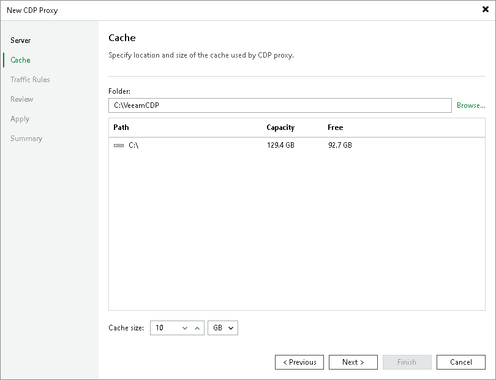

# Step 3. Configure Cache

In this article

At the Cache step of the wizard, specify the path to a folder where cached data will be stored and how much space can be used for storing the cache.

For more information on the cache, see [CDP Proxy Cache](cdp_proxy.md#cache).

Page updated 10/16/2025

Page content applies to build 13.0.1.1071
