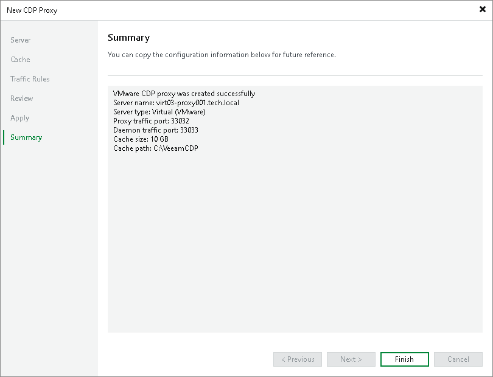

# Step 7. Finish Working with Wizard

In this article

At the Summary step of the wizard, review details of the server added as the CDP proxy and click Finish to exit the wizard.

Page updated 10/24/2025

Page content applies to build 13.0.1.1071
