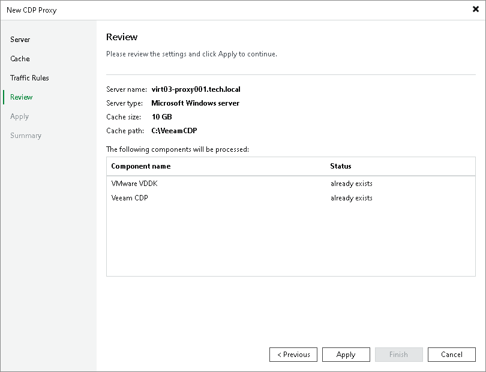

# Step 5. Review Settings and Install Components

At the Review step of the wizard, review components which are already installed on the server and which will be installed. Click Apply to start installation of missing components.

