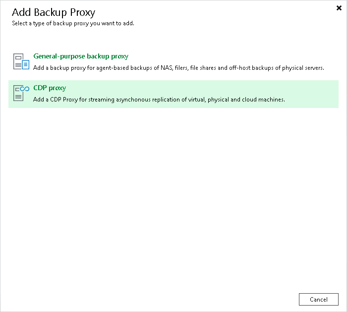

# Step 1. Launch New VMware Proxy Wizard

In this article

To launch the New CDP Proxy wizard, do the following:

1. Open the Backup Infrastructure view.
2. In the [inventory pane](vbr_ui.md), right-click the Backup Proxies node and select Add Proxy. Alternatively, you can click Add Proxy on the ribbon.
3. In the Add Backup Proxy window, select CDP proxy.

Page updated 10/16/2025

Page content applies to build 13.0.1.1071
