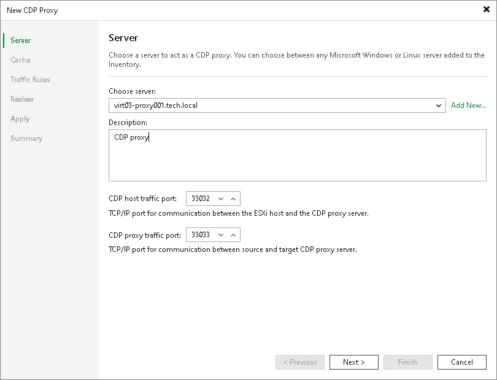

# Step 2. Select Server and Traffic Ports

In this article

At the Server step of the wizard, select a server which you want to use as the CDP proxy, specify description and ports that will be used for communication:

1. From the Choose server drop-down list, select a physical or virtual Microsoft Windows-based or Linux-based server to which you want to assign the CDP proxy role.

If you have not added a server to the backup infrastructure, click Add New to open the Add Server wizard, and follow the instructions from the [Adding Microsoft Windows Servers](add_windows_server.md) or [Adding Linux Servers](add_linux_server.md) section.

1. In the Proxy description field, provide a description for future reference.
2. In the CDP host traffic port field, specify a port that the source and target host will use to communicate with the CDP proxy.

The range of available ports is 33032–33039.

1. In the CDP proxy traffic port field, specify a port that the proxy will use to communicate with other CDP proxies.

The range of available ports is 33032–33039.

|  |
| --- |
| Important |
| You must specify different values in the CDP host traffic port and CDP proxy traffic port fields. |

Page updated 10/16/2025

Page content applies to build 13.0.1.1071
