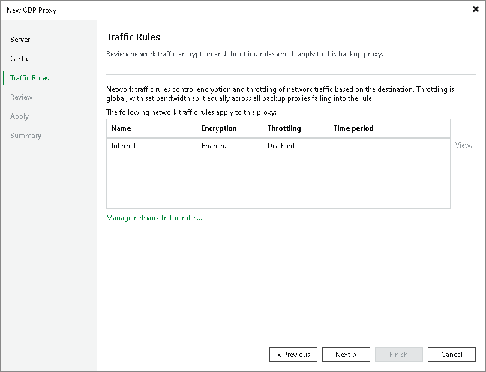

# Step 4. Configure Network Traffic Rules

At the Traffic Rules step of the wizard, configure network traffic rules. These rules help you reduce, throttle and encrypt traffic sent between backup infrastructure components. For more information, see [Managing Network Traffic](managing_network_traffic.md).

The list of network traffic rules contains only the rules that are applicable to the CDP proxy — this means that the proxy IP address falls into the IP range of a rule.

To change network traffic settings:

1. Click the Manage network traffic rules link.
2. To edit or remove a rule, select the required rule and click Edit or Remove.
3. To add a rule, click Add and follow the instructions from the [Configuring Network Traffic Rules](network_rules.md) section.
4. To choose networks over which Veeam Backup & Replication will send data between backup infrastructure components, click Networks. Then follow the instructions in steps 3–6 in the [Specifying Preferred Networks](select_backup_network.md) section.

