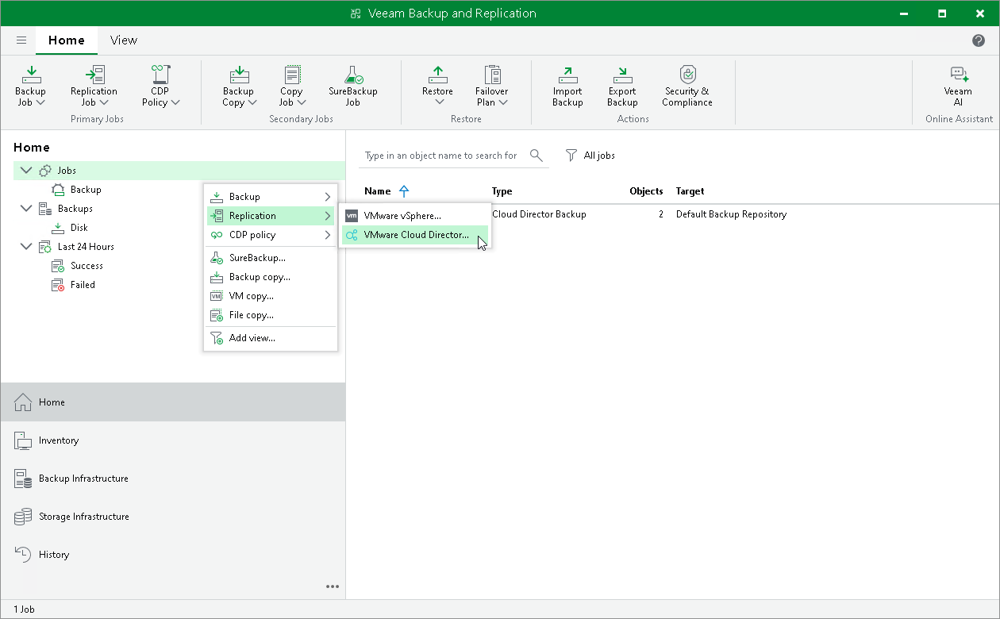

# Step 1. Launch New Replication Job Wizard

In this article

To launch the New Replication Job wizard, do one of the following:

* On the Home tab, click Replication Job > VMware vCloud Director.
* Open the Home view, in the inventory pane right-click Jobs and select Replication > VMware vCloud Director.

Page updated 6/10/2025

Page content applies to build 13.0.1.1071
