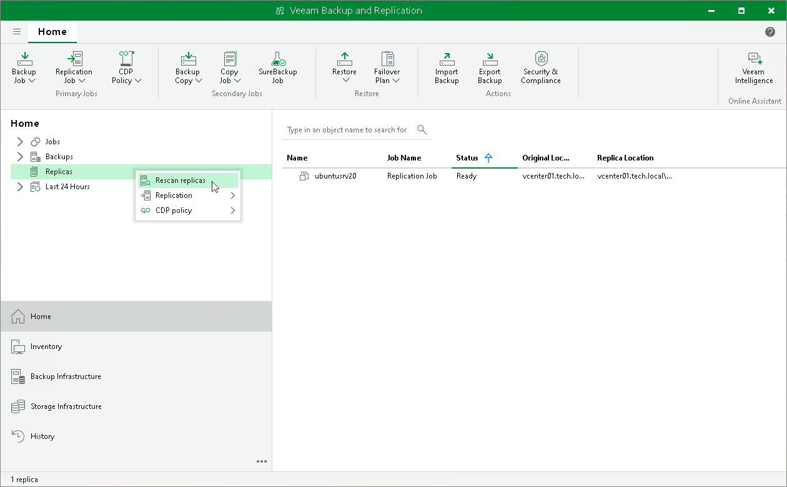

# Rescanning CDP Replicas

In this article

You may need to perform replica rescan, for example, if the actual states of replicas differ from the states in the configuration database, if changes were made in the backup infrastructure and so on.

During the rescan process, Veeam Backup & Replication gathers information on replicas that are currently available and updates the list of replicas in the configuration database.

To rescan replicas, do the following:

1. Open the Home view.
2. In the inventory pane, right-click the Replicas node and select Rescan Replicas.

Page updated 9/25/2025

Page content applies to build 13.0.1.1071
