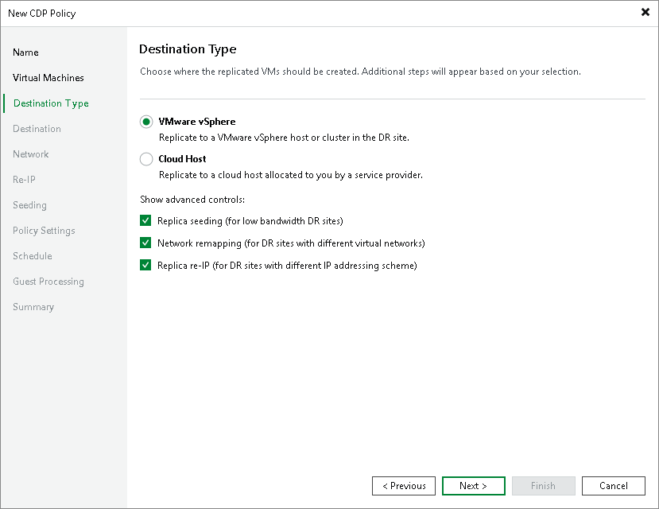

# Step 5. Select Destination Type

At the Destination Type step of the wizard, select the type of the host or cluster to which you want to replicate workloads, also select if you want to use replication, network mapping or replica re-IP:

1. Select the type of the host or cluster to which you want to replicate workloads:

* VMware vSphere to replicate workloads to a VMware vSphere host or cluster.

For more information on the required infrastructure, see [Backup Infrastructure for CDP](cdp_infrastructure.md).

* Cloud Host to replicate workloads to the cloud host allocated to you by the service provider (SP).

For more information, see the [Continuous Data Protection (CDP) with Veeam Cloud Connect](https://helpcenter.veeam.com/docs/vbr/cloud/cloud_connect_cdp.html?ver=13) section in the Veeam Cloud Connect Guide. For more information on the required infrastructure, see the [CDP Infrastructure in Veeam Cloud Connect](https://helpcenter.veeam.com/docs/vbr/cloud/cloud_connect_cdp_infrastructure.html?ver=13) Veeam Cloud Connect Guide.

1. If a network between your production and disaster recovery (DR) sites has low bandwidth, and you want to reduce the amount of traffic sent during the initial synchronization of the CDP policy, select the Replica seeding (for low bandwidth DR sites) check box.

When selected, this check box enables the Seeding step where you will have to configure replica seeding and mapping.

1. If your DR site networks do not match your production site networks, select the Network remapping (for DR sites with different virtual networks) check box.

When selected, this check box enables the Network step where you will have to configure a network mapping table.

1. If the IP addressing scheme in your production site differs from the scheme in the DR site, select the Replica re-IP (for DR sites with different IP addressing scheme) check box.

When selected, this check box enables the Re-IP step where you will have to configure replica re-IP rules.

Page updated 2026-06-25

