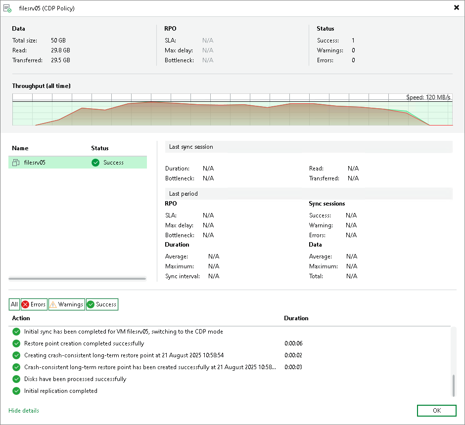

# Viewing Session Statistics and Results

Veeam Backup & Replication allows you to view real-time statistics and session results for a workload added to a CDP policy:

* To view real-time statistics for the policy, open the Home view. In the inventory pane select Jobs > CDP. In the working area, double-click the necessary policy. Alternatively, right-click the policy and select Statistics. In the opened window, you will be able to switch between statistics of individual workload.
* To view real-time statistics for an individual workload, open the Home view. In the inventory pane select Jobs, Last 24 hours or Running. In the working area, double-click the necessary workload. Alternatively, right-click the workload and select Statistics.
* To view statistics on the finished policy sessions, open the History view. In the inventory pane select CDP. In the working area, double-click the necessary policy session.

The statistics provides detailed data on policy sessions: duration, performance bottlenecks, amount of processed data, read and transferred data.

Statistics Counters

Veeam Backup & Replication displays policy statistics for the following counters:

* The Last 24 hours (all VMs) section shows the general information for all workloads for which you have opened the statistics. This information is collected during 24 hours.

* The Data box shows information about processed data:

+ Total size — total size of the processed data.
+ Read — amount of data read from the datastore prior to applying compression and deduplication. The value of this counter is typically lower than the value of the Total size counter. Veeam Backup & Replication reads only data blocks that have changed since the last policy session, processes and copies these data blocks to the target.
+ Transferred — amount of data transferred from the source CDP proxy to the target CDP proxy. The data is transferred after compression and deduplication.

* The RPO box shows information related to RPO:

+ SLA — percentage of sessions completed within the desired RPO.
+ Max delay — difference between the configured RPO and time required to transfer and save data.
+ Bottleneck — bottleneck in the data transmission process.

* The Status box shows information about task session results. This box informs how many task sessions have completed with the Success, Warning and Error statuses during the 24-hour session. One task session lasts for the period between the creation of two long-term restore points.

* The Last sync session section shows general information collected during the last synchronization session of the 24-hour session. One synchronization session lasts for the period between the creation of the two short-term restore points.

* Duration — time period during which data was collected and sent to the target host.
* Bottleneck — bottleneck in the data transmission process.
* Read — amount of data read from the datastore prior to applying compression and deduplication.
* Transferred — amount of data transferred from the source CDP proxy to the target CDP proxy. The data is sent after compression and deduplication.

* The Last period section shows general information collected during the last task session of the 24-hour session. One task session lasts for the period between the creation of two long-term restore points.

* The RPO box shows information related to RPO:

+ SLA — percentage of sessions completed within the desired RPO.
+ Max delay — difference between the configured RPO and time required to transfer and save data.
+ Bottleneck — bottleneck in the data transmission process.

* The Sync session box shows information about synchronization session results. This box informs how many synchronization sessions have completed with the Success, Warning and Error statuses during the last task session. One synchronization session lasts for the period between the creation of the two short-term restore points.
* The Duration box shows information about duration of synchronization sessions:

+ Average — average duration of a synchronization session.
+ Maximum — maximum duration of a synchronization session.
+ Sync interval — duration of a synchronization session configured in the policy, that is, the specified RPO.

* The Data box shows information about processed data:

+ Average — average amount of data processed within one synchronization session.
+ Maximum — maximum amount of data processed within one synchronization session.
+ Total — total size of data sent during the task session.

* The pane at the left shows the list of workloads included into the session statistics.

* The pane at the bottom shows the list of operations performed during the session. If you open statistics for a policy, you can see the list of operations for the whole policy or an individual workload. To see the list of operations for an individual workload, click the workload in the pane on the left. To see the list of operations for the whole policy, click anywhere on the blank area in the left pane.

Colored Graph

To visualize the data transfer process, Veeam Backup & Replication displays a colored graph in the statistics window:

* The green color defines the amount of data read from the source.
* The brown color defines the amount of data transferred to the target.
* The horizontal line defines the current data processing speed.

If the session is still being performed, you can click the graph to view data rate for the last 5 minutes or the last 24 hours. If the session has already ended, the graph will display information for the last 24 hours only.

The colored graph is displayed only for the currently running session or the latest finished session. If you open statistics for past sessions other than the latest one, the colored graph will not be displayed.

