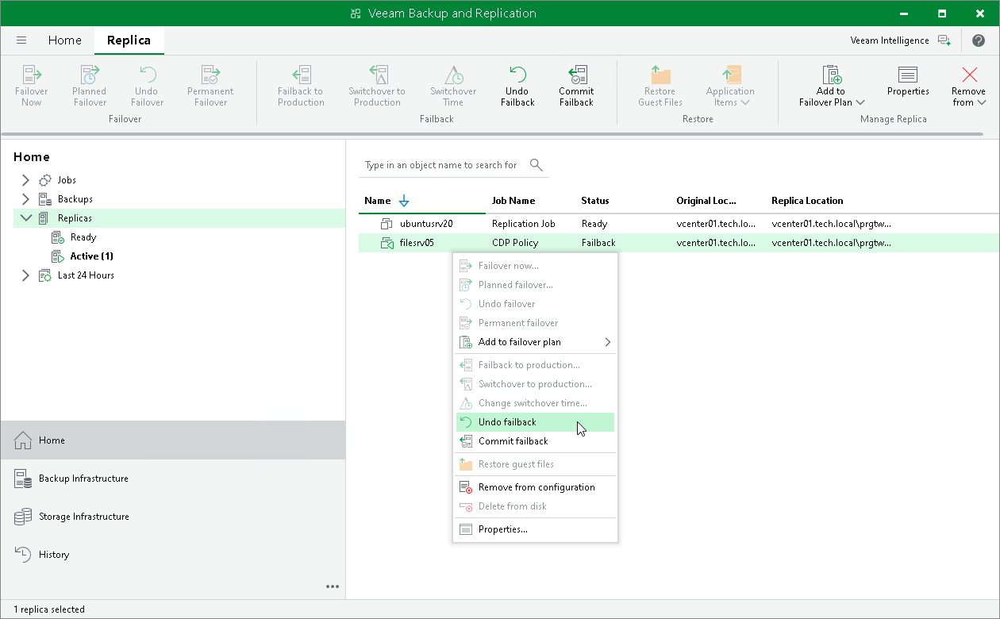

# Undoing Failback

In this article

For more information on failback undo, see [Failover and Failback for CDP](cdp_failover_failback.md) and [Failback Undo](cdp_failback_undo.md).

To undo failback:

1. Open the Home view.
2. In the [inventory pane](vbr_ui.md), navigate to the Replicas > Active node.
3. In the working area, select the necessary replica and click Undo Failback on the ribbon. Alternatively, you can right-click the necessary replica and select Undo Failback.

Page updated 9/26/2025

Page content applies to build 13.0.1.1071
