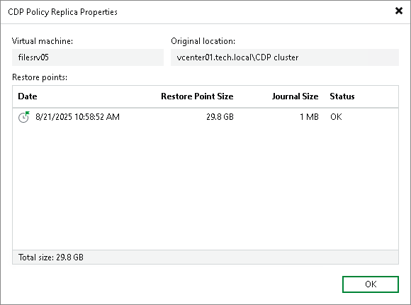

# Viewing Replica Properties

To view replica properties:

1. Open the Home view.
2. In the [inventory pane](vbr_ui.md), select Replicas.
3. In the working area, right-click the necessary replica and select Properties. Alternatively, select Properties on the ribbon.

