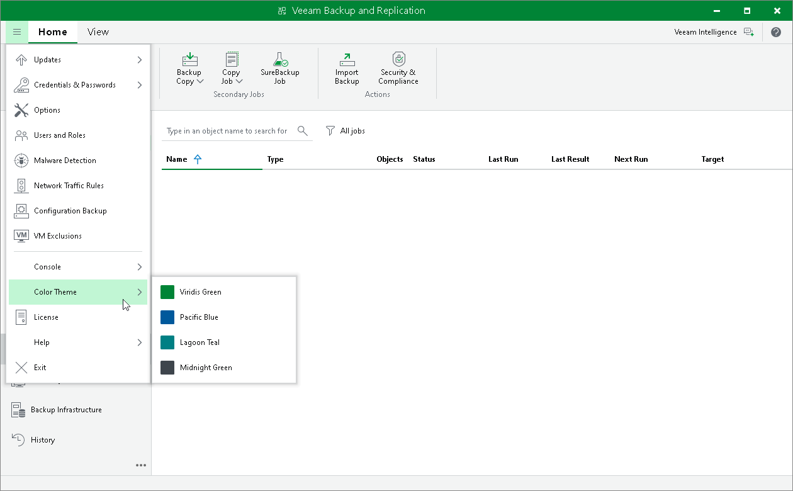

# Changing Color Theme

By default, Veeam Backup & Replication uses a ‘Veeam Green’ color theme for the UI. If necessary, you can change the color theme. Changing the color theme can be helpful, for example, if you connect to different backup servers from one remote machine on which the Veeam Backup & Replication console is installed. In this case, you will be able to easily differentiate with which backup server you are currently working.

To change the color theme for Veeam Backup & Replication:

1. From the main menu, select Color Theme.
2. Choose one of the color themes: Viridis Green, Pacific Blue, Lagoon Teal, Midnight Green.

|  |
| --- |
| Note |
| Color theme settings are applicable for a specific combination of a backup server and user account. For example, the color theme is initially set to the default one. You log on to the Veeam Backup & Replication console under a user account and change the color theme to Lagoon Teal. If you log on to the same backup server under the same account next time, the color theme will be set to Lagoon Teal. If you log on to the same backup server under another account, Veeam Backup & Replication will use the color theme that was previously set for this account — that is, the default color theme. |

