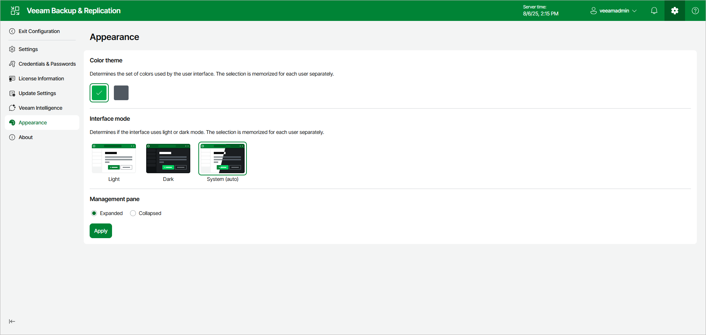

# Changing Appearance Settings

In this article

If necessary, you can change the appearance settings of the Veeam Backup & Replication web UI. Changing the color theme can be helpful, for example, if you connect to different backup servers from one remote machine. In this case, you will be able to easily differentiate with which backup server you are currently working.

To change the appearance settings for the Veeam Backup & Replication web UI:

1. Click the gear icon in the top bar and select Appearance.
2. Choose one of the two color themes.
3. Choose if the interface will use the light or dark mode, or follow the system settings.
4. Choose how to display the [management pane](vbr_web_console.md#management_pane): expanded or collapsed.

|  |
| --- |
| Note |
| Color theme settings are applicable for a specific combination of a backup server and user account. For example, the color theme is initially set to the default one. You log on to the Veeam Backup & Replication web UI under a user account and change the interface mode to the dark one. If you log on to the same backup server under the same account next time, the interface mode will be set to dark. If you log on to the same backup server under another account, Veeam Backup & Replication will use the appearance settings that were previously set for this account — that is, the default light interface mode. |

Page updated 9/30/2025

Page content applies to build 13.0.1.1071
