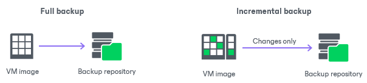

# Changed Block Tracking

In this article

To perform incremental backup, Veeam Backup & Replication needs to know what data blocks have changed since the previous job session.

For VMware VMs with hardware version 7 and later, Veeam Backup & Replication employs a native VMware vSphere feature — VMware vSphere Changed Block Tracking (CBT). Instead of scanning VMware VMFS (Virtual Machine File System), Veeam Backup & Replication queries CBT through VMware VADP (VMware vStorage API for Data Protection) and gets a list of blocks that have changed since the last job session. The use of CBT increases the speed and efficiency of block‑level incremental backups.

Veeam Backup & Replication uses CBT for the following operations:

* Backup
* Replication
* Entire VM restore
* VM disk restore

Veeam Backup & Replication enables CBT by default. If necessary, you can disable it in job settings.

|  |
| --- |
| NotE |
| Mind the following:   * If you back up a VM to which the backup proxy role is assigned and that uses [Virtual appliance (HotAdd)](virtual_appliance.md) transport mode, CBT for this VM is disabled and cannot be enabled. * Ensure the virtual machine has no snapshots before enabling VMware vSphere CBT. Once you enable CBT, snapshots can be created on the virtual machine and backed up. For more information, see [this KB article](https://kb.vmware.com/s/article/1020128). * If a VM had active snapshots during backup creation and an active snapshot was deleted before the next job run, CBT will not be used. In this case, Veeam Backup & Replication will read the entire VM from the datastore. |

|  |
| --- |
| Note |
| For VMs with virtual disks in thin format, Veeam Backup & Replication also uses CBT during active full backup sessions to detect unallocated regions of virtual disks and skip them. For VMs with virtual disks on an NFS datastore, Veeam Backup & Replication uses CBT as well but cannot leverage CBT on the first full run. |

In some situations, Veeam Backup & Replication cannot leverage VMware vSphere CBT, for example, if VMs run an earlier version of virtual hardware. If Veeam Backup & Replication cannot leverage VMware vSphere CBT, it fails over to the Veeam proprietary filtering mechanism. Instead of tracking changed blocks of data, Veeam Backup & Replication filters out unchanged data blocks.

During VM processing, Veeam Backup & Replication consolidates virtual disk content, scans through the VM image and calculates a checksum for every data block. Checksums are stored as metadata to backup files next to VM data. When incremental backup is run, Veeam Backup & Replication opens all backup files in the chain of previous full and incremental backups, reads metadata from these files and compares it with checksums calculated for a VM in its current state. If a match is found (which means the block already exists in the backup), this block is filtered out.

Page updated 11/18/2025

Page content applies to build 13.0.1.1071
