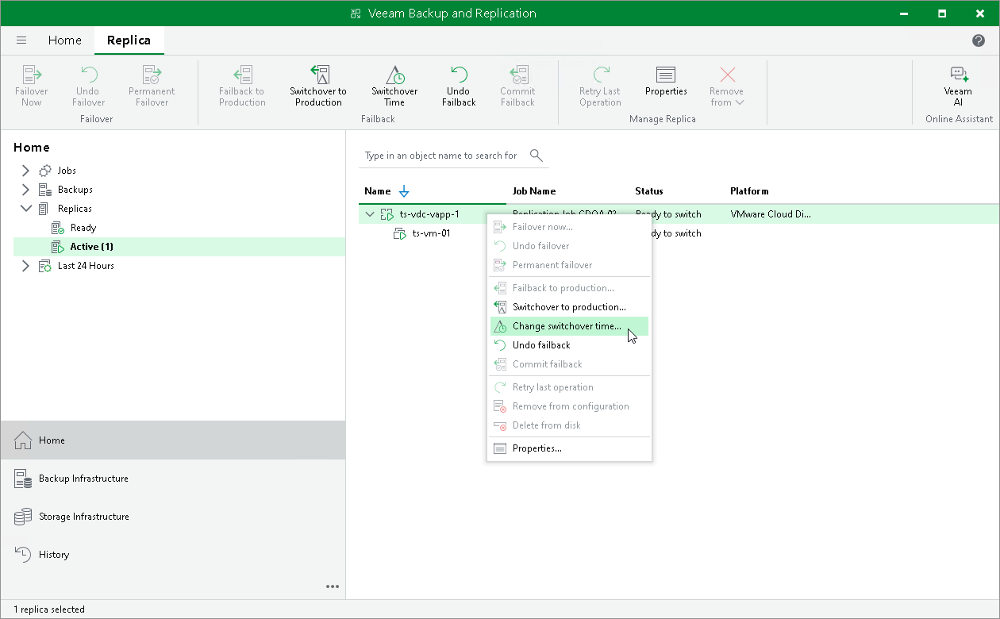

# Changing Switching Time

The following instructions apply if you have selected to switch from replicas to production vApps manually or at the scheduled time at at the Failback Mode step of the Failback wizard.

To change the time when the switch from replicas to production vApps must be performed:

1. Open the Home view.
2. In the inventory pane, navigate to the Replicas > Active node.
3. In the working area, select the vApp in the Ready to switch state and select Switchover Time on the ribbon. Alternatively, you can right-click the necessary vApp and select Change switchover time.

If the switching time operation failed, you can retry this operation again. To perform a retry, in the working area, select the necessary vApp and select Retry Switchover Time on the ribbon. Alternatively, you can right-click the necessary vApp and select Retry switchover time.

