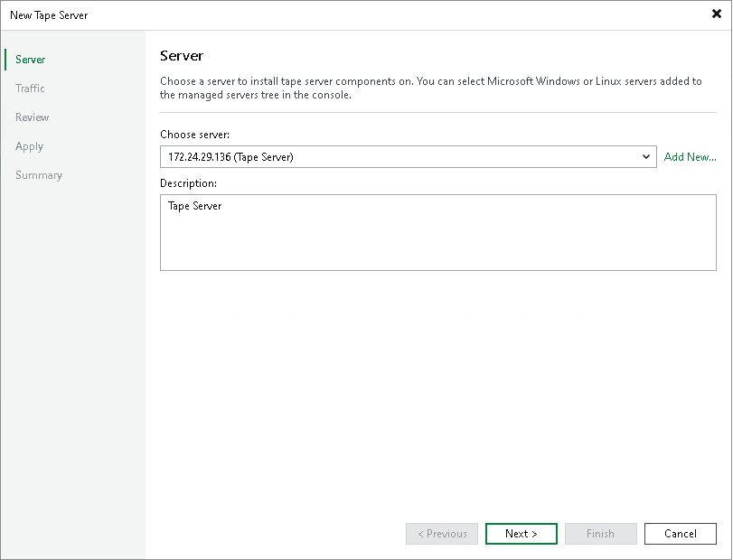

# Step 2. Choose Server

In this article

At the Server step of the wizard, choose a physical or virtual server to which the tape devices are connected and that you want to add as the tape server.

1. From the Choose server list, select the server that you want to add as the tape server. As a tape server, you can use a Microsoft Windows or Linux server, physical or virtual, added to the Veeam Backup & Replication infrastructure. For the tape server system requirements, see [System Requirements](system_requirements.md#tape_server).

If the server is not added to Veeam Backup & Replication yet, you can click Add New to add a new Windows server or Linux server to the backup infrastructure. To learn how to add those servers to the backup infrastructure, see [Adding Microsoft Windows Servers](add_windows_server.md) and [Adding Linux Servers](add_linux_server.md).

|  |
| --- |
| Note |
| The tape server role requires root access rights. For this reason, Veeam Software Appliance, Veeam Infrastructure Appliance and hardened repository cannot be used as the tape server. |

1. In the Description field, provide a description for future reference.

Page updated 9/12/2025

Page content applies to build 13.0.1.1071
