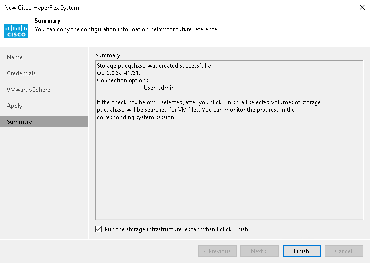

# Step 6. Finish Working with Wizard

At the Summary step of the wizard, do the following:

1. Review settings of the added storage system.
2. Select the Run the storage infrastructure rescan when I click Finish check box if you want to start the rescan right after you finish working with the wizard. For more information on the rescan process, see [Rescan (Storage Discovery) Process](storage_discovery_process.md).
3. Click Finish to close the wizard.

