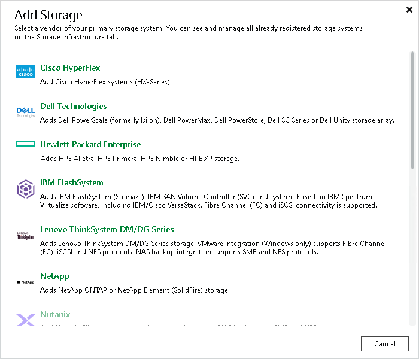

# Step 1. Launch New Cisco HyperFlex System Wizard

To launch the New Cisco HyperFlex System wizard, do one of the following:

* Open the Storage Infrastructure view. In the working area, click Add Storage. In the displayed window, click Cisco HyperFlex.
* Open the Storage Infrastructure view. In the inventory pane, right-click the Storage Infrastructure node and select Add Storage. In the displayed window, click Cisco HyperFlex.
* You can use this method if at least one Cisco HyperFlex storage system is added to the backup infrastructure.

Open the Storage Infrastructure view. In the inventory pane, right-click the Cisco HyperFlex node under Storage Infrastructure and select Add Storage. You can also select the Cisco HyperFlex node in the inventory pane, right-click anywhere in the working area and select Add storage.

