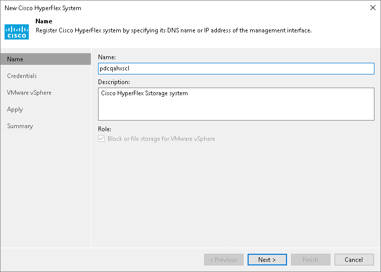

# Step 2. Specify Storage Name or Address and Storage Role

At the Name step of the wizard, specify the storage system name and description:

1. In the DNS name or IP address field, enter a full DNS name or IPv4 address of the Cisco HyperFlex cluster management interface.
2. In the Description field, provide a description for future reference. The default description contains information about the user who added the storage system, date and time when the server was added.

Only VMware backup jobs are allowed to access this storage system, so the VMware backup check box is selected automatically in the Role field.

