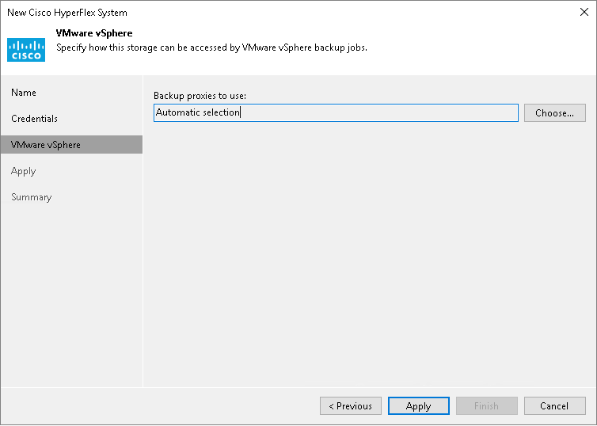

# Step 4. Specify VMware Access Options

In this article

At the VMware vSphere step of the wizard, select backup proxies that you plan to use for backup and replication of VMs hosted on Cisco HyperFlex. Veeam Backup & Replication will check what data retrieval methods are available for these backup proxies. For more information, see [Methods of Data Retrieval](cisco_backup_proxy.md#methods).

+ Leave Automatic selection to let Veeam Backup & Replication check which [data retrieval method](cisco_backup_proxy.md#methods) is used for each backup proxy in the backup infrastructure. Veeam Backup & Replication will choose an optimal backup proxy for processing.
+ Click Choose and select Use the selected backup proxy servers only to define backup proxies that can be used for processing. In this case, Veeam Backup & Replication will check which [data retrieval method](cisco_backup_proxy.md#methods) is used and will select an optimal proxy only among the selected backup proxies.

Page updated 3/18/2024

Page content applies to build 13.0.1.1071
