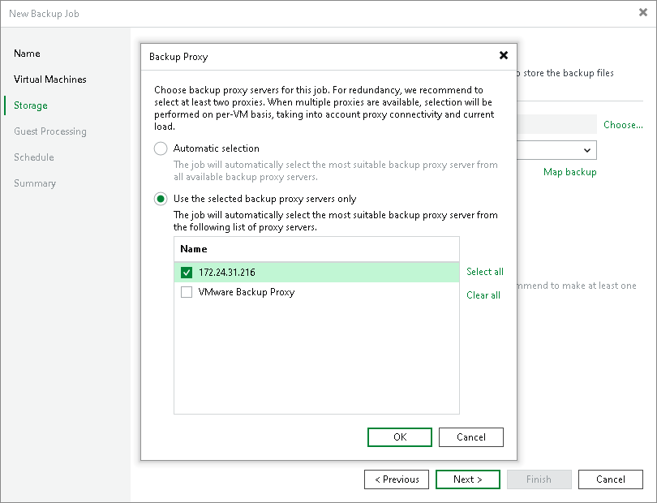
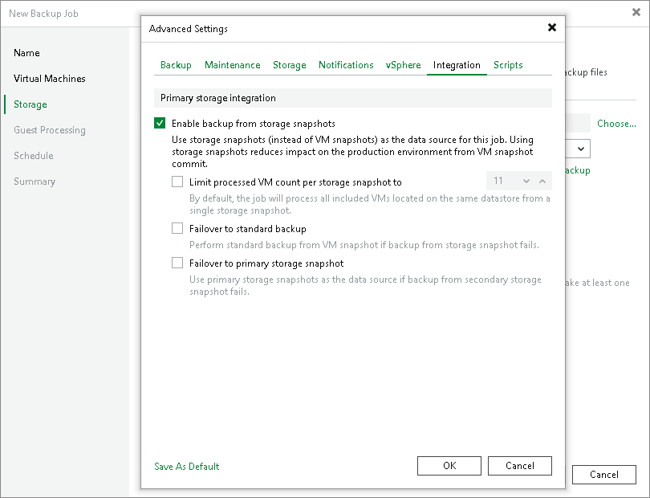

# Configuring Backup from Cisco HyperFlex Snapshots

To back up and replicate from Cisco HyperFlex snapshots:

1. Configure a backup or replication job. At the Storage step of the backup or replication job wizard, select a backup proxy that will be used for data transport. You can assign the backup proxy explicitly or choose the automatic mode of backup proxy selection.

1. At the Storage step of the wizard, click Advanced, then click the Integration tab. Make sure that the Enable backup from storage snapshots check box is selected. By default, this option is enabled for all newly created jobs.
2. If Veeam Backup & Replication fails to process VMs in the full integration mode, VMs hosted on Cisco HyperFlex will not be backed up or replicated. To fail over to the regular data processing mode, select the Failover to standard backup check box.

