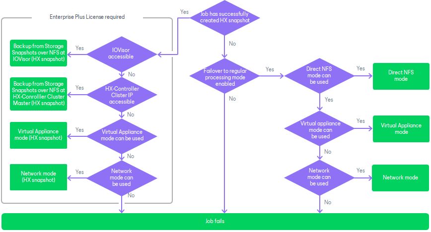
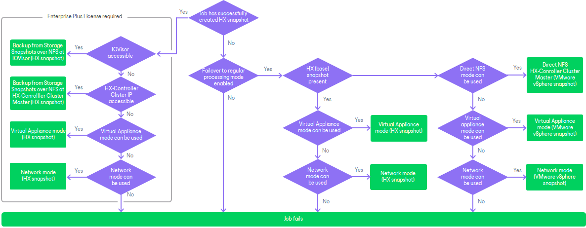

# Configuring Backup Proxies

In this article

This section describes how to configure VMware backup proxies for using Cisco HyperFlex snapshots and also which transport modes and methods of data retrieving proxies can use.

Requirements

To enable backup and replication from Cisco HyperFlex snapshots, you must configure one or more backup proxies in the backup infrastructure. Backup proxies must meet the following requirements:

* Check requirements listed in section [Requirements for Proxies](storage_configure_proxy.md).
* The backup proxy that you plan to use must have NFS access to the network handling traffic between Cisco HyperFlex and ESXi hosts where the backed-up or replicated VMs reside.

Methods of Data Retrieving for Direct NFS Access Transport Mode

Backup proxies that work in the Direct NFS access transport mode and process data of VMs hosted on Cisco HyperFlex can read VM data from NFS stores over the NFS HyperFlex data network. Depending on the backup infrastructure configuration, backup proxies can read data over the following data paths:

* Backup from storage snapshots over IO Visor on ESXi hosts. The IO Visor is a Cisco HyperFlex software module that runs on every ESXi host that is a part of the Cisco HyperFlex cluster. It presents HyperFlex NFS datastores to the ESXi hosts and optimizes the data paths in the HyperFlex cluster.

Backup over IO Visor is the preferred method. It provides the high speed of VM data reading and balances the load across the HyperFlex cluster. To read VM data over IO Visor, backup proxies must be connected to the same HyperFlex data network as the processed VMs. You must also configure a firewall rule on the ESXi hosts to allow Veeam Backup & Replication to interact with the IO Visor. For more information, see [Configuring Firewall Rules for Cisco HyperFlex IOVisor Processing](#firewall).

If the firewall rules are not configured, Veeam Backup & Replication will fail over to Backup from Storage Snapshot over the HyperFlex Controller Cluster IP by default.

* Backup from storage snapshots over HyperFlex Controller Cluster IP. In this processing mode, all traffic is handled by a single HX controller that holds the HyperFlex Controller Cluster IP.

To read VM data over HyperFlex Controller Cluster IP, backup proxies must be connected to the same HyperFlex data network as the processed VMs. If the storage system is added to the backup infrastructure, Veeam Backup & Replication will configure all necessary firewall settings within the HyperFlex Controllers automatically during the storage discovery process. Veeam Backup & Replication automatically detects new HyperFlex controllers and applies firewall changes. If the storage system is not added to the backup infrastructure, you must configure the firewall as described in [this Veeam KB article](https://www.veeam.com/kb2300).

Selecting Proxies and Transport Modes

You can instruct Veeam Backup & Replication to read data from Cisco HyperFlex snapshots in the following transport modes: Direct storage access, Virtual appliance or Network. The recommended mode is Direct storage access working over NFS protocol. It provides the best performance and low overhead on ESXi hosts. In this mode, Veeam Backup & Replication bypasses the ESXi host, reads and writes data directly to Cisco HyperFlex NFS data network.

When a job starts, Veeam Backup & Replication analysis which proxies can be used for processing VMs and selects a proxy for each VM. If multiple proxies can be used for a VM, Veeam Backup & Replication selects a proxy with the most prioritized transport mode.

The following diagrams show how Veeam Backup & Replication prioritizes transport modes for each proxy. The diagrams also show how Veeam Backup & Replication chooses proxies when Cisco HyperFlex snapshots cannot be created. In this case, Veeam Backup & Replication performs standard data processing. Note that to use regular data processing, you must enable [Failover to standard backup](cisco_backup_configure.md) option.

To learn whether a proxy can use a specific transport mode, see the necessary topics in the [Transport Modes](transport_modes.md) section in the Veeam Backup & Replication User Guide.

Transport Mode Selection for HyperFlex version 4.5(2a) or later

Transport Mode Selection for HyperFlex version Before 4.5 (2a)

Configuring Firewall Rules for Cisco HyperFlex IO Visor Processing

The Cisco HyperFlex IO Visor is a software component that runs on all ESXi hosts within a Cisco HyperFlex cluster. It works as an NFS server for Veeam traffic.

You need to allow NFS traffic from the backup proxies to ESXi hosts. As Cisco IO Visor based NFS communication uses dynamic ports, you need to create an ESXi firewall rule with inbound ports 0-65535 and the backup proxy IP addresses as allowed IP addresses.

Configuring Backup Proxies for Backup from Storage Snapshot with Virtual Appliance or Network mode

If you plan to use the Virtual appliance or Network mode to process VMs hosted on Cisco HyperFlex, you must configure the backup infrastructure in the following way:

1. You must add Cisco HyperFlex to the backup infrastructure to allow Veeam Backup & Replication to create HyperFlex snapshots.
2. You must configure the backup proxies to work in the Virtual appliance or Network transport mode. For more information, see the [Virtual Appliance (HotAdd)](virtual_appliance.md) and [Network Mode](network_mode.md) sections in the Veeam Backup & Replication User Guide
3. If you plan to use the Virtual appliance mode, it is recommended that you enable an optimization for NFS datastores in Veeam Backup & Replication to avoid VM stuns as described in [this VMware KB article](http://kb.vmware.com/kb/2010953). To do this:

1. Create a backup proxy on every host in the VMware vSphere cluster where VMs that you plan to back up or replicate reside.
2. On the machine where the Veeam Backup & Replication server is installed, open Registry Editor.
3. Navigate to the key: HKLM\Software\Veeam\Veeam Backup and Replication\.
4. Create a new DWORD with the name EnableSameHostHotaddMode, and set its value to 2.

If a backup proxy on the same host as a processed VM is unavailable, Veeam Backup & Replication will use an available backup proxy on a different host, but force it to use the Network transport mode, so that no stun occurs.

Page updated 4/17/2025

Page content applies to build 13.0.1.1071
