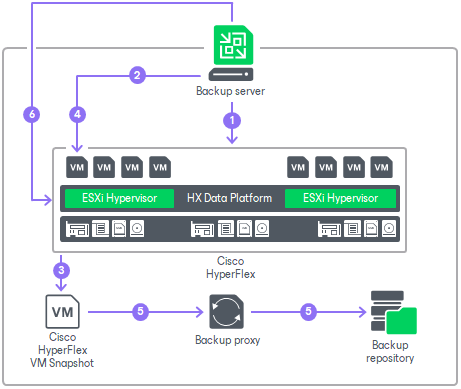

# How Backup from Cisco HyperFlex Snapshots Works

In this article

When you perform backup or replication from Cisco HyperFlex snapshots, Veeam Backup & Replication performs the following actions:

1. Veeam Backup & Replication analyses which VMs in the job are hosted on Cisco HyperFlex.
2. If application-aware processing is enabled, Veeam Backup & Replication quiesces data and applications on VMs guest OSes.
3. Veeam Backup & Replication triggers Cisco HyperFlex VM snapshots for every processed VM.
4. If application-aware processing is enabled, Veeam Backup & Replication resumes quiesced I/O activities on VMs guest OSes.
5. Veeam Backup & Replication reads new virtual disk data blocks (for full job session) or changed virtual disk data blocks with CBT (for incremental job sessions) from Cisco HyperFlex NFS stores and transports them to the backup repository or target datastore.
6. After VM data processing is finished, Veeam Backup & Replication triggers removal of the Cisco HyperFlex VM snapshots.

Page updated 8/4/2023

Page content applies to build 13.0.1.1071
