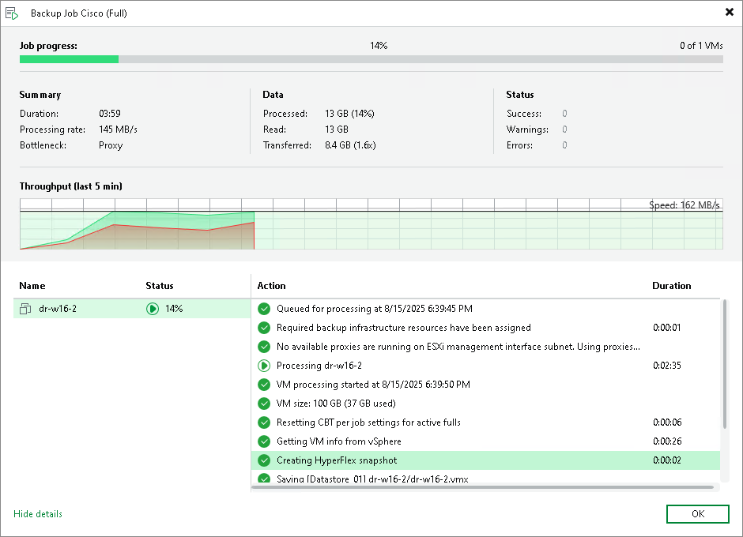

# Backup from Cisco HyperFlex Snapshots

Veeam Backup & Replication integrates with Cisco HyperFlex and allows you to improve performance of backup and replication of VMware vSphere VMs hosted on Cisco HyperFlex.

For backup and replication of VMs hosted on Cisco HyperFlex, Veeam Backup & Replication uses Cisco HyperFlex VM snapshots to preserve VMs in a consistent state suitable for backup or replication. Cisco HyperFlex creates space efficient VM snapshots almost instantly. Veeam Backup & Replication, in its turn, uses HyperFlex snapshots for VM data processing, which helps speed up backup and replication operations, reduce impact of backup and replication activities on the production environment and improve RPOs.

Implementation of integration with Cisco HyperFlex is different from those provided for other supported storage systems. When Veeam Backup & Replication processes VMs hosted on Cisco HyperFlex, it leverages snapshots created at the VM level, not snapshots created at the storage volumes level.

In This Section

* [How Backup from Cisco HyperFlex Snapshots Works](cisco_hiw.md)
* [Configuring Backup Proxies](cisco_backup_proxy.md)
* [Configuring Backup from Cisco HyperFlex Snapshots](cisco_backup_configure.md)

