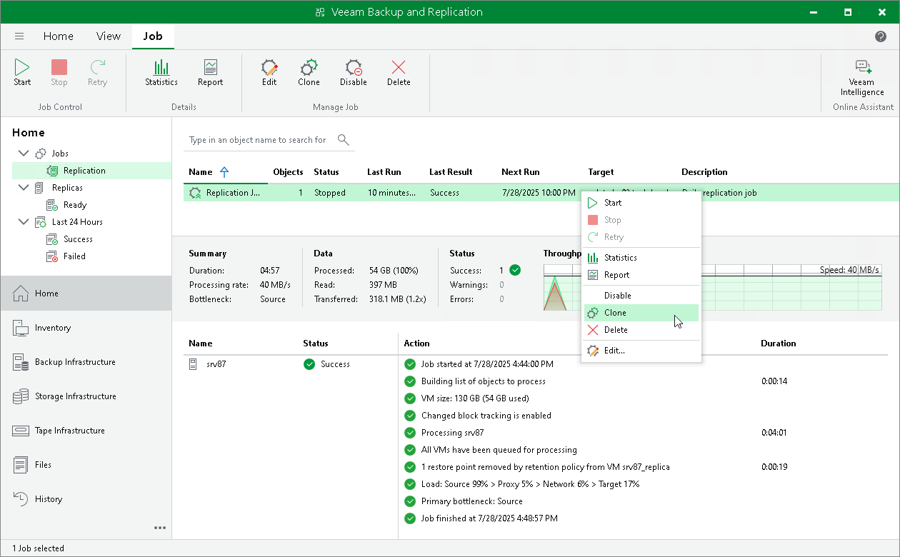

# Cloning Replication Jobs

In this article

You can create new jobs by means of job cloning. Job cloning allows you to create an exact copy of any job with the same job settings and edit settings of cloned jobs as required.

The name of the cloned job is formed by the following rule: <job\_name\_clone1>, where job\_name is the name of the original job and clone1 is a suffix added to the original job name. If you clone the same job again, the number in the name will be incremented, for example, job\_name\_clone2, job\_name\_clone3 and so on.

To clone a job:

1. Open the Home view.
2. In the inventory pane, select the Jobs > Replication node.
3. In the working area, select the job and click Clone on the ribbon or right-click the job and select Clone.
4. After a job is cloned, you can edit all its settings, including the job name.

Page updated 1/23/2025

Page content applies to build 13.0.1.1071
