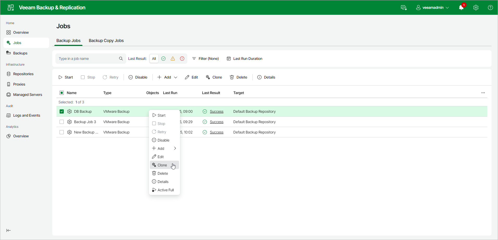

# Cloning Jobs

In this article

You can create new jobs using job cloning. Job cloning allows you to create an exact copy of any job with the same job settings. Configuration information of the created job copy is written to the configuration database that stores information about the original job.

To create multiple jobs with similar settings, you can configure a set of jobs that will be used as "job templates". You can then clone these "job templates" and edit the settings of cloned jobs as required.

The name of the cloned job is formed by the following rule: <job\_name\_clone1>, where job\_name is the name of the original job and clone1 is a suffix added to the original job name. If you clone the same job again, the number in the name will be increased, for example, job\_name\_clone2, job\_name\_clone3, and so on.

When cloning a job, Veeam Backup & Replication can change some job settings so that cloned jobs do not hinder original jobs.

* If the original job is scheduled to run automatically, Veeam Backup & Replication disables the cloned job. To enable the cloned job, select it in the job list and click Disable on the ribbon or right-click the job and select Disable.
* If the original job is configured to use a secondary target, the cloned job is created without the secondary target settings.

To clone a job:

1. In the management pane, click the Jobs node.
2. In the working area, select a job and click Clone on the ribbon or right-click the job and select Clone.
3. After a job is cloned, you can edit all its settings, including the job name.

Page updated 9/23/2025

Page content applies to build 13.0.1.1071
