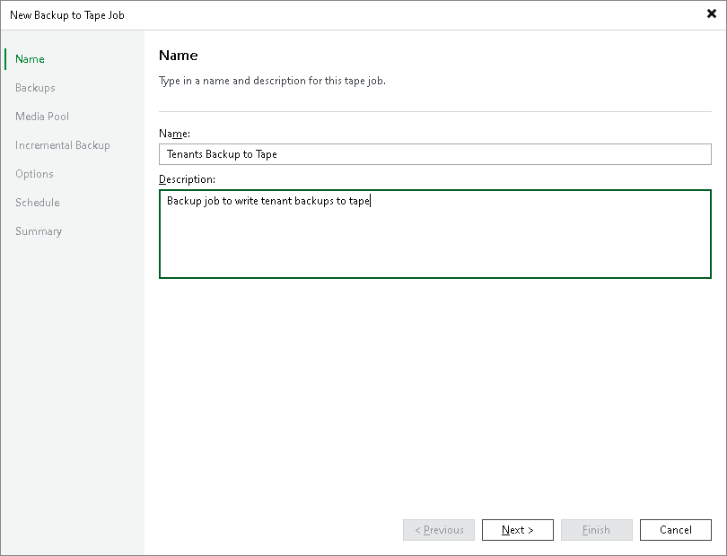
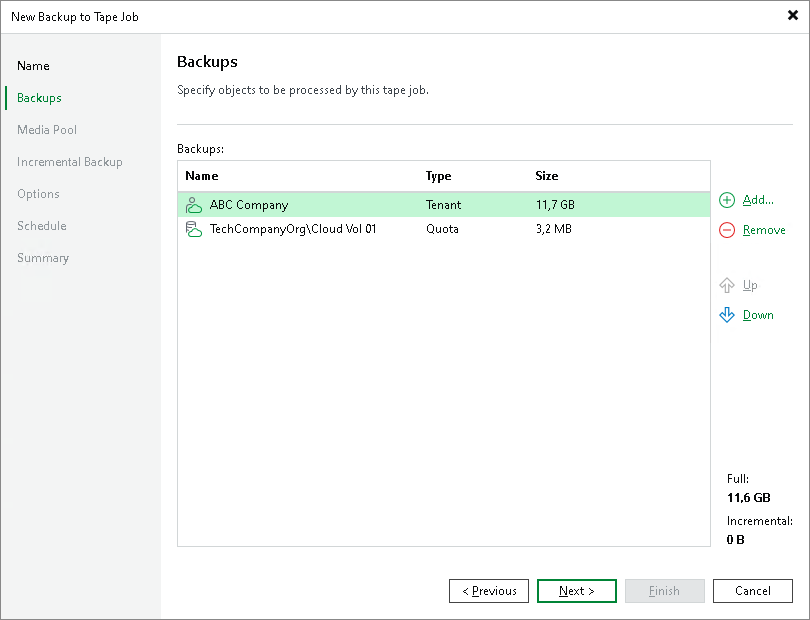
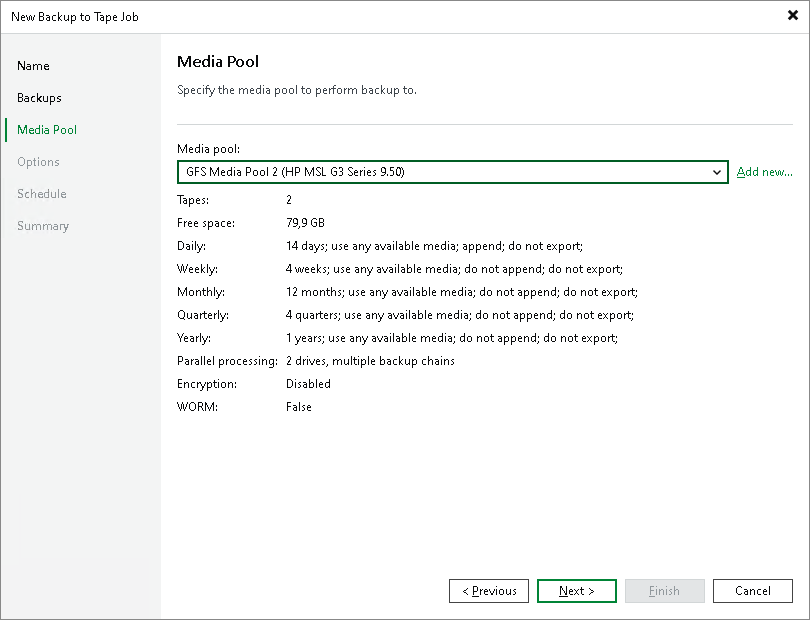
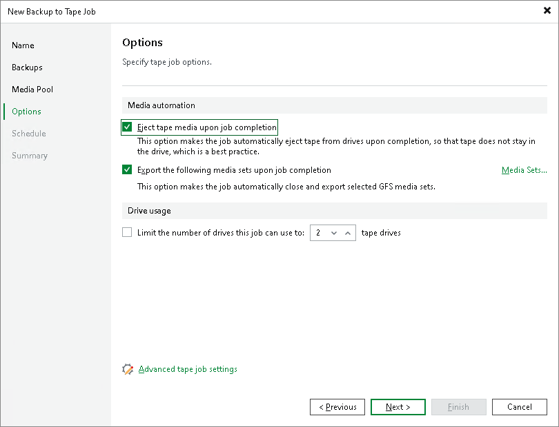
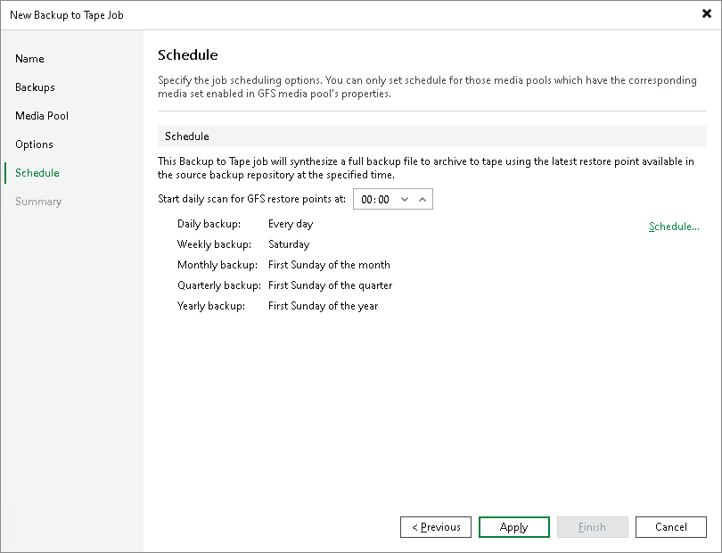
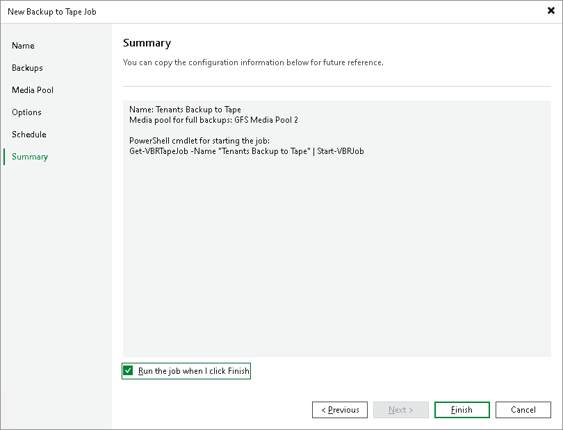

In this article

To back up tenant data to tape, you must configure a backup to tape job. One job can be used to process data of one tenant or several tenants. You can select the following objects as a source for a backup to tape job intended to process tenant data:

* All tenants
* One or more specific tenants
* One or more cloud repositories of the same tenant or different tenants

|  |
| --- |
| Note |
| This section describes only basic steps that you must take to create a backup to tape job intended to back up tenant data. To get a detailed description of all backup to tape job settings, see the [Creating Backup to Tape Jobs](https://helpcenter.veeam.com/docs/vbr/userguide/creating_backup_to_tape_jobs.html?ver=13) section in the Veeam Backup & Replication User Guide. |

Before you configure a backup to tape job, complete the following prerequisites:

1. You must add a tape server in Veeam Backup & Replication on the SP backup server.
2. You must configure one or more GFS media pools with the necessary media set and retention settings. You can configure media pools in advance, before you launch the Backup to Tape Job wizard. You can also configure media pools at the Media Pool step of the wizard.

To create a backup to tape job:

1. On the Home tab, click Tape Job and select Backups.
2. At the Name step of the wizard, specify a name and description for the backup to tape job.

1. At the Backups step of the wizard, click Add > Tenants and select tenants or cloud repositories whose data you want to write to tape.

1. At the Media Pool step of the wizard, choose a media pool for tenant backups. You can select only GFS media pools.

|  |
| --- |
| Tip |
| If you have not previously created a media pool with the required settings, you can click Add New and create a new GFS media pool without closing the job wizard. For more details, see [Creating GFS Media Pools](https://helpcenter.veeam.com/docs/backup/vsphere/creating_gfs_media_pools.html?ver=120). |

1. At the Options step of the wizard, specify archiving and media automation options.

1. Select the Eject media upon job completion check box if the tape should be automatically ejected from the tape drive after the job successfully finishes. The ejected tapes are placed into a free tape device slot. Note that if the job started and failed, the tape will remain in the drive.

This option does not prevent the tape job from appending data to this tape. If not configured otherwise in media pool settings, this tape will be placed into a drive on the next tape job run.

1. Select the Export the following media sets upon job completion check box if you want to pull out the tapes with daily, weekly, monthly, quarterly or yearly media sets from the tape device, for example, to move to a storage location. The tape device will eject the tapes that belong to the selected media set.

Click Media Sets and select the media sets that you want to export.

1. Click Advanced and specify the necessary settings for the tape job.
2. At the Schedule step of the wizard, click Schedule and select days for each media set. In the Start daily scan for GFS restore points at field, specify the time when the job must start. By default, the GFS job starts at 12:00 AM on the selected day.

1. At the Summary step of the wizard, select the Run the job when I click Finish check box if you want to start archiving tenant backups to tape right after you complete working with the wizard.

1. Click Finish.

Page updated 11/11/2025

Page content applies to build 13.0.1.1071
