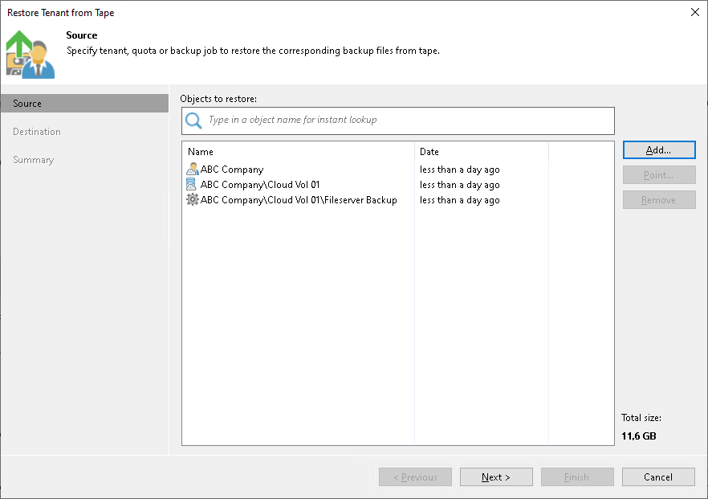
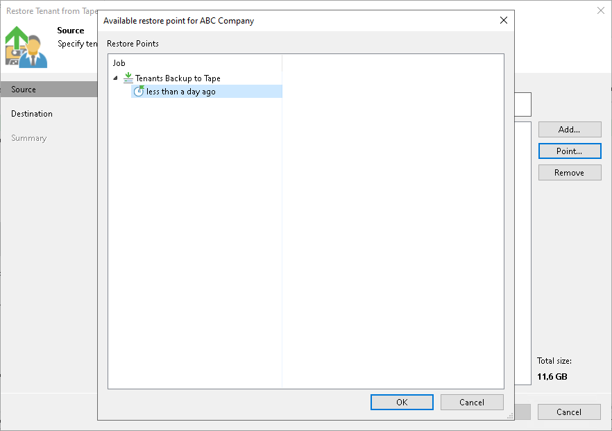
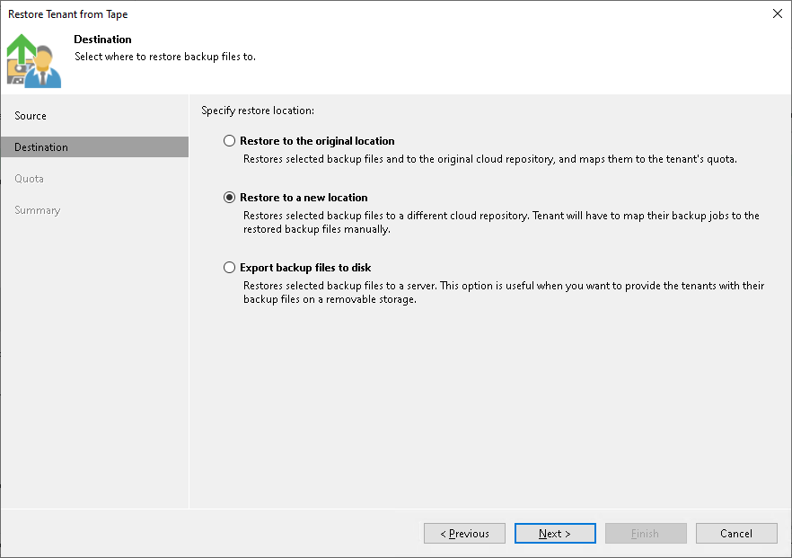
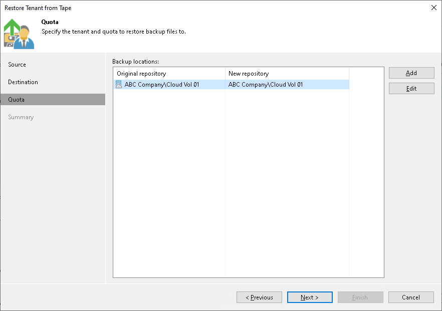
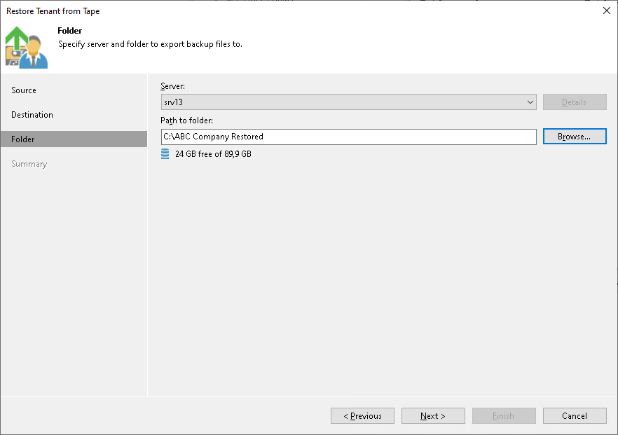
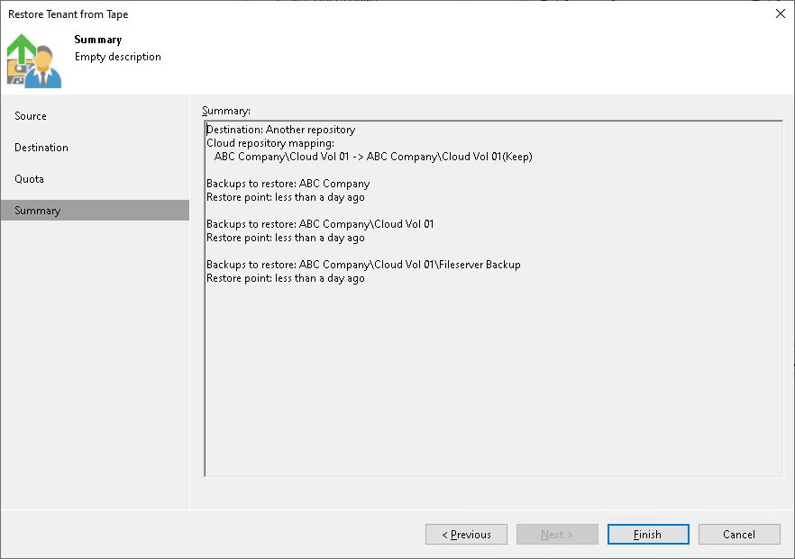

# Restoring Tenant Data from Tape

The SP can restore tenant data from tape. The SP can simultaneously restore data of one tenant or multiple tenants, both to the original location or to a new location. Tenant backups can be recovered to the latest state or a specific day.

To restore tenant data from tape:

1. Open the Home view.
2. Select the Backups > Tape node in the inventory pane. Expand the backup to tape job in the working area, right-click the necessary tenant and select Restore backup from tape to repository.
3. At the Source step of the wizard, select one or more tenants whose data you want to restore.

To add one or more tenants to the list, click Add and select more tenants. For data restore, you can select the tenant itself, specific cloud repository or backup job.

1. By default, Veeam Backup & Replication restores tenant data from the latest restore point. If you want to restore to an earlier state, select the tenant in the list and click Point. In the Restore Points section, select a restore point from which you want to restore tenant data.

1. At the Destination step of the wizard, select where tenant data should be restored:

* Restore to the original location. If you select this option, Veeam Backup & Replication will restore tenant backups to the original cloud repository. The existing backups will be overwritten.

During the restore process, the tenant account will be disabled. After the restore process is completed, Veeam Backup & Replication will rescan the SP, display restored backups in the tenant backup console and map tenant backup jobs to the restored backup chains.

|  |
| --- |
| Tip |
| Veeam Backup & Replication automatically rescans the SP once in 15 minutes. The tenant can also perform this operation manually in the Veeam backup console. |

* Restore to a new location. If you select this option, Veeam Backup & Replication will restore tenant backups to another cloud repository. Use this option if you do not want to overwrite tenant backups in the original cloud repository.

After the restore process is completed, Veeam Backup & Replication will rescan the SP and display restored backups in the tenant backup console.

* Export backup files to disk. If you select this option, Veeam Backup & Replication will export tenant backups to a specified folder on a server in the SP Veeam backup infrastructure.

During this process, Veeam Backup & Replication will save full backup files (VBK) and incremental backup files (VIB) to the specified location. Backup metadata files (VBM) will not be restored from tape.

After the export process is completed, the SP can perform operations with the backup files upon request from a tenant. The tenant cannot access this backup files from the tenant Veeam backup console.

1. If you chose to restore tenant data to a new cloud repository, at the Quota step of the wizard, specify the tenant and cloud repository that you want to use as a new location for the restored data:

1. To create a new tenant and cloud repository without closing the restore wizard, click Add and follow the steps of the New Tenant wizard. To learn more, see [Creating Tenant Accounts](cloud_connect_tenant.md).
2. To specify a new cloud repository where tenant data will be restored, click Edit and select the necessary tenant and cloud repository.
3. If the original cloud repository and a new cloud repository are the same, Veeam Backup & Replication will prompt you to choose whether you want to overwrite tenant data in the original cloud repository.

* To overwrite original tenant data with data from the backup on tape, in the prompt window, click Overwrite.
* To save tenant data restored from tape next to original tenant data, in the prompt window, click Keep.

1. If you chose to restore tenant data to a folder, at the Folder step of the wizard, specify the server and the folder where you want to restore tenant backup files.

1. In the Server field, select the server from the list of servers added to the Veeam backup infrastructure.
2. In the Path to folder field, specify the folder where you want to place the restored backups.

1. At the Summary step of the wizard, review the restore settings.

1. Click Finish.

