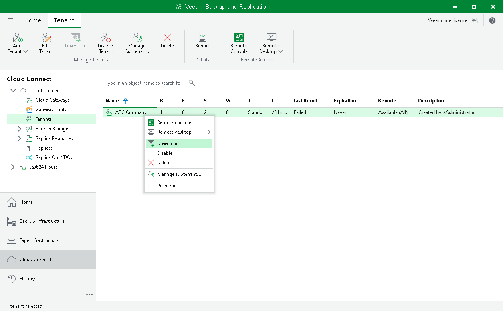

In this article

The SP can download tenant data that was offloaded to an object storage repository back to the on-premises extents of a scale-out backup repository. Veeam Backup & Replication lets the SP download all offloaded tenant backups at once. Downloaded backups remain in the performance tier and cannot be moved back to the capacity tier.

To download tenant data from capacity tier to performance tier:

1. Open the Cloud Connect view.
2. In the inventory pane, click the Tenants node.
3. In the working area, select the necessary tenant and click Download on the ribbon or right-click the tenant and select Download.
4. In the displayed window, select what backup files you want to download from the capacity tier to the on-premises extents:

* Click All Backups to download all tenant backup files.
* Click Latest Only to download tenant backup files pertaining to the latest backup chain only.

1. In the SOBR Download window, monitor the progress of the download operation and click OK.

Page updated 4/17/2024

Page content applies to build 13.0.1.1071
