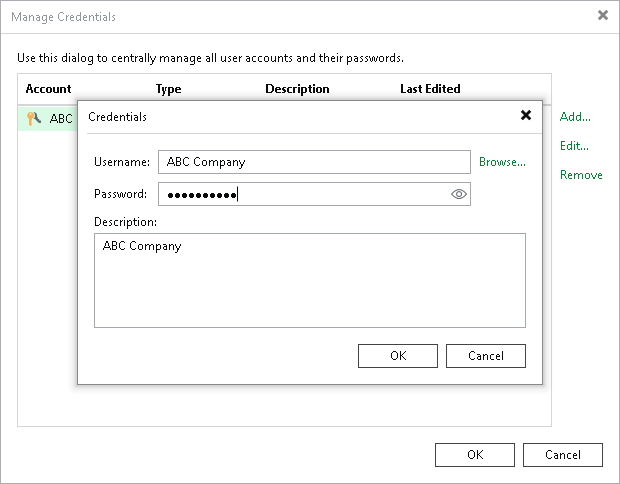

In this article

You can change the password for the tenant account whose credentials you obtained from the SP.

This operation is performed by the tenant in the tenant Veeam Backup & Replication console.

|  |
| --- |
| Note |
| You cannot change the password for a VMware Cloud Director tenant account. For such accounts, passwords are managed by the SP in VMware Cloud Director. |

To change a password for the tenant account:

1. In the tenant Veeam Backup & Replication console, from the main menu, select Credentials and Passwords > Cloud Credentials.
2. In the Manage Cloud Credentials window, select the user name of the tenant account whose password you want to change and click Edit.
3. Veeam Backup & Replication will display a notification informing that tenant credentials are currently used to connect to the SP. In the notification window, click Yes.
4. In the Credentials window, in the Password field, enter a new password for the tenant account and click OK.

To view the entered password, you can click and hold the eye icon on the right of the field.

1. In the Current Password field, enter the current password of the tenant account and click OK.
2. In the Manage Cloud Credentials window, click OK.

Page updated 1/30/2024

Page content applies to build 13.0.1.1071
