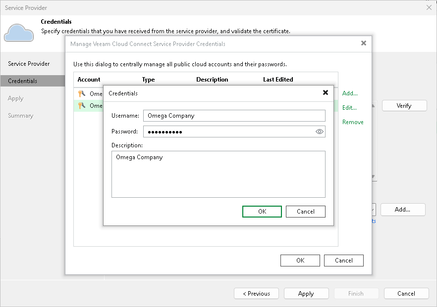

In this article

The SP can change the password for the tenant account.

|  |
| --- |
| Note |
| Consider the following:   * The tenant can also change the password for the tenant account using the Veeam backup console on the tenant backup server. To learn more, see [Changing Password for Tenant Account](cc_change_password.md). * You cannot use the Veeam backup console to change the password for a VMware Cloud Director tenant account. For such accounts, passwords are managed in VMware Cloud Director. |

To change a password for the tenant account (performed by the SP on the SP Veeam backup server):

1. Open the Cloud Connect view.
2. In the inventory pane, click Tenants.
3. In the working area, right-click the necessary tenant and select Properties.
4. At the Tenant step of the Edit Tenant wizard, specify a new password in the Password field or click the Generate new link at the bottom of the field. In the latter case, Veeam Backup & Replication will generate a safe password. You will be able to get a copy the generated password at the last step of the wizard.
5. At the Summary step of the Edit Tenant wizard, click the Copy password to clipboard link at the bottom of the wizard window and click Finish to save the changes.
6. Inform the tenant about the password change and make sure that the tenant reconnects to the SP using the new password.

To reconnect to the SP (performed by the tenant on tenant Veeam backup server):

1. Open the Backup Infrastructure view.
2. In the inventory pane, click the Service Providers node.
3. In the working area, right-click the SP and select Properties.
4. At the Credentials step of the Service Provider wizard, click the Manage accounts link at the bottom of the Credentials field.
5. In the Manage Veeam Cloud Connect Service Provider Credentials window, click Edit.
6. In the displayed window notifying that the edited credentials are used to connect to the SP, click Yes.
7. In the Credentials window, enter a new password in the Password field and click OK.
8. Follow the next steps of the Service Provider wizard without changing default settings. At the Summary step of the wizard, click Finish.

Page updated 1/30/2024

Page content applies to build 13.0.1.1071
