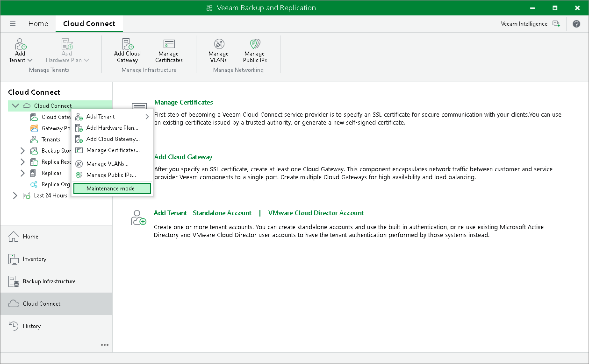
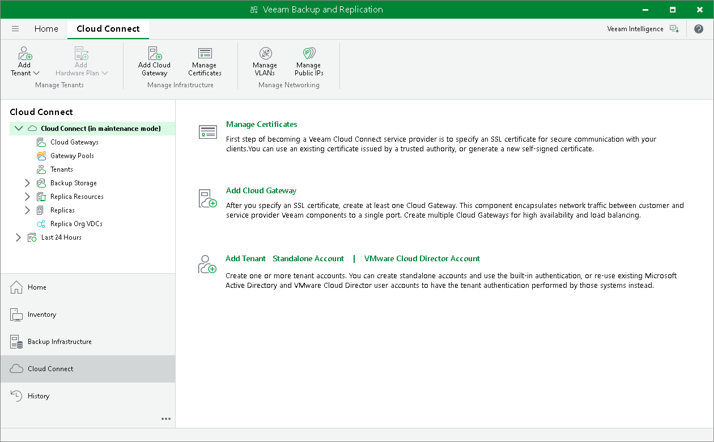

In this article

The SP can switch the SP backup server to the Maintenance mode. When the SP backup server operates In the Maintenance mode, Veeam Backup & Replication notifies tenants who perform backup and backup copy jobs that the SP backup server is under maintenance and cloud resources are temporary unavailable.

To switch the SP backup server to the Maintenance mode:

1. Open the Cloud Connect view.
2. In the inventory pane, right-click the Cloud Connect node and select Maintenance mode.
3. In the displayed window, Veeam Backup & Replication informs you about the impact of maintenance mode on tenant jobs. Click Yes.
4. If there are any replicas in the Failover or Failback state, Veeam Backup & Replication displays a window informing you about the impact of maintenance mode on active replication tasks. Click Yes.

To bring the SP backup server back to the normal operational mode, right-click the Cloud Connect node and select Maintenance mode once again.

When the SP backup server is put to the Maintenance mode, Veeam Backup & Replication changes the status of the backup server and displays the Maintenance mode icon in the Cloud Connect view of the backup console.

Related Topics

[Maintenance Mode](cc_maintenance_mode.md)

Page updated 8/26/2024

Page content applies to build 13.0.1.1071
