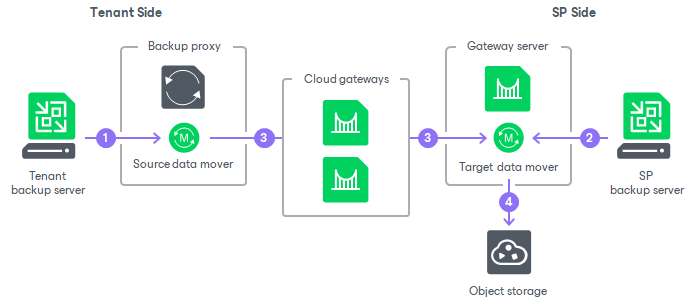
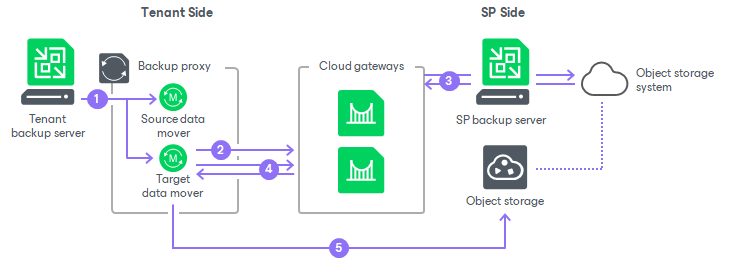

# How Backup to Object Storage Works

To back up data directly to object storage repository deployed on the SP side, Veeam products on the tenant side communicate with the object storage in one of the following connection modes:

* [Connection through a gateway server](#gated_mode)
* [Direct connection](#direct_mode)

Connection Through Gateway Server

In this mode, data traffic passes through a gateway server deployed in the Veeam Backup & Replication infrastructure on the SP side. This gateway server is specified in the object storage repository settings in the SP backup Veeam Backup & Replication console. Backup to the object storage works in the following way:

1. Veeam Backup & Replication on the tenant backup server starts the source Veeam Data Mover on the source backup proxy to access the object storage.

In case of Veeam Agent backup, the source Veeam Data Mover is started on the Veeam Agent machine.

1. Veeam Backup & Replication on the SP backup server starts the target Veeam Data Mover on the gateway server.
2. The source Veeam Data Mover sends backup data from Veeam Backup & Replication or Veeam Agent to the target Veeam Data Mover located on the gateway server on the SP side. The data passes through the cloud gateway.
3. The target Veeam Data Mover transfers backup data from the gateway server to the object storage used as a cloud repository.

Direct Connection

In this mode, the tenant backs up data to the object storage directly. Backup to the object storage works in the following way:

1. Veeam Backup & Replication on the tenant backup server starts the source Veeam Data Mover and the target Veeam Data Mover, both on the source backup proxy.

In case of Veeam Agent backup, the source and the target Veeam Data Movers are started on the Veeam Agent machine.

1. The target Veeam Data Mover starts communication with the SP backup server through the cloud gateway.
2. Veeam Backup & Replication on the SP backup server obtains temporary credentials for the tenant from the object storage system.

To learn more about temporary credentials, see [Credentials for Direct Connection Mode](#credentials).

1. Veeam Cloud Connect sends credentials to the target Veeam Data Mover along with information about available storage quota. The target Veeam Data Mover uses these credentials to access object storage. The target Veeam Data Mover communicates constantly with the SP backup server to check and update information about available backup storage space.
2. The target Veeam Data Mover transfers backup data directly to the object storage.

During this process, the SP backup server and the tenant backup server keep persistent connection to each other through the cloud gateway to communicate credentials and backup storage space information.

|  |
| --- |
| Note |
| Keep in mind that direct backup to the S3 compatible object storage requires an additional action on the SP side. After selecting the Direct connection mode in the object storage repository settings, the SP must configure [access permissions](#s3compatible_options) to access the object storage. Until the SP specifies access permissions, backup data to the S3 compatible object storage is transferred through the cloud gateway regardless of the Direct connection mode in the repository settings. |

Credentials for Direct Connection Mode

To access the object storage in the Direct connection mode, Veeam products on the tenant side use temporary credentials. The SP obtains credentials from the object storage system and provides them to the tenant. Credentials are used in the following way:

* For backup to Google Cloud and AWS object storage, the tenant uses credentials with a limited access.

An expiration date for temporary credentials is 14 days. When connecting to the cloud gateway, the tenant Veeam Backup & Replication checks how much time is left before the expiration date. If there is less than 24 hours until the expiration date or if credentials have already expired, Veeam Backup & Replication renews them.

The temporary credentials are obtained through object storage APIs and saved in the configuration database on the SP side. On the tenant side, the credentials are kept encrypted in the target Veeam Data Mover runtime process and are not saved in the configuration database.

* For backup to Azure object storage, the tenant uses SAS (shared access signature) links.

By default, the links are valid for 30 days. When the tenant requests credentials, Veeam Backup & Replication checks how much time is left before expiration. If there is less than 15 days or if SAS links have already expired, Veeam Backup & Replication reissues them. The SP can instruct Veeam Backup & Replication to override default time limits with a registry key. For more information, contact [Veeam Customer Support](https://www.veeam.com/support.html).

* For backup to S3 compatible object storage, Veeam Backup & Replication offers three access permission options. Note that these take priority over Connection through a gateway server and Direct connection connection modes. The options are following:

* Agents share credentials to object storage repository. If the SP selects this option, the cloud gateway passes the full set of credentials that are used in the repository settings to the tenant.
* Provided by the backup server. If the SP selects this option, Veeam Backup & Replication does not pass credentials to the tenant side, and backup to the object storage is performed in a similar way to the Connection through a gateway server mode. With this option selected, backup to the object storage works in the following way:

* The target Veeam Data Mover starts on the mount server selected in object storage settings.
* The target Veeam Data Mover on the mount server processes data in the same way as the target Veeam Data Mover on a gateway server in the Connection through a gateway server mode.
* Backup data is transferred between the source Veeam Data Mover and the target Veeam Data Mover through the cloud gateway.

This option is selected by default. For the data traffic to go directly from the tenant side to the object storage, the SP must select another access permission option.

* Provided by IAM/STS object storage capabilities. If the SP selects this option, Veeam Cloud Connect creates and provides credentials with limited access for the tenant.

In addition to configuring object storage settings, the SP must specify access permissions for each S3 compatible object storage repository added in the Veeam Cloud Connect infrastructure . For configuration details, see the [Managing Permissions for S3 Compatible Object Storage](https://helpcenter.veeam.com/docs/vbr/userguide/access_permissions.html?ver=13#managing-permissions-for-s3-compatible-object-storage) section in the Veeam Backup & Replication User Guide.

Veeam Backup & Replication on the SP backup server passes temporary credentials to the tenant side only for backup, restore and other necessary operations. Temporary credentials provide tenants and subtenants with the following permissions:

* Read access to the backup repository configuration.
* Full access to the folder in the object storage where cloud repository quota for the tenant or subtenant is allocated.

For details on object storage permissions in the Direct connection mode, see [Access Permissions for Direct Connection to Object Storage](cc_object_storage_permissions.md).

