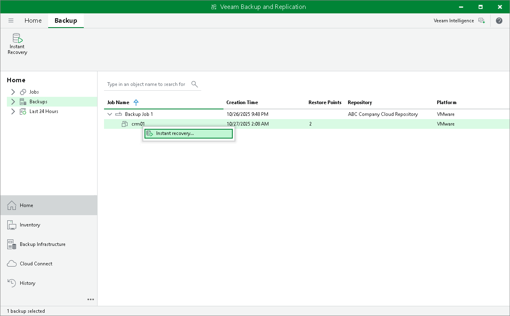

In this article

The SP can perform Instant Recovery for tenant workloads, that is, recover workloads from tenant backups in the cloud repository and register them as VMware vSphere VMs.

Before you perform Instant Recovery, check prerequisites and limitations. For details, see [Instant Recovery from Tenant Backups](cloud_connect_instant_recovery.md).

To perform Instant Recovery:

1. In the SP backup console, launch the Instant Recovery to VMware vSphere wizard.

1. Open the Home view.
2. In the inventory pane, click the Backups node.
3. In the working area, click the backup whose data you want to restore to a VMware vSphere VM and click Instant Recovery on the ribbon or right-click the necessary backup and select Instant recovery.

To select multiple backups, press and hold the [CTRL] key, and then click or right-click the necessary backups.

1. In the displayed window, click Yes to confirm that the tenant will be disabled during Instant Recovery.
2. Follow the steps of the Instant Recovery to VMware vSphere wizard.

The Instant Recovery procedure for tenant backups is similar to the same procedure in the regular Veeam Backup & Replication infrastructure. The difference is that you cannot recover tenant backups to their original location — Instant Recovery in the Veeam Cloud Connect infrastructure is performed to a VMware vSphere VM on the SP virtualization host. Thus, in this scenario the Instant Recovery to VMware vSphere wizard does not include the Restore Mode step.

To get a detailed description of all Instant Recovery options, see the [Performing Instant Recovery to VMware vSphere Using Console](https://helpcenter.veeam.com/docs/vbr/userguide/performing_instant_recovery_vm.html?ver=13) section in the Veeam Backup & Replication User Guide.

Page updated 11/11/2025

Page content applies to build 13.0.1.1071
