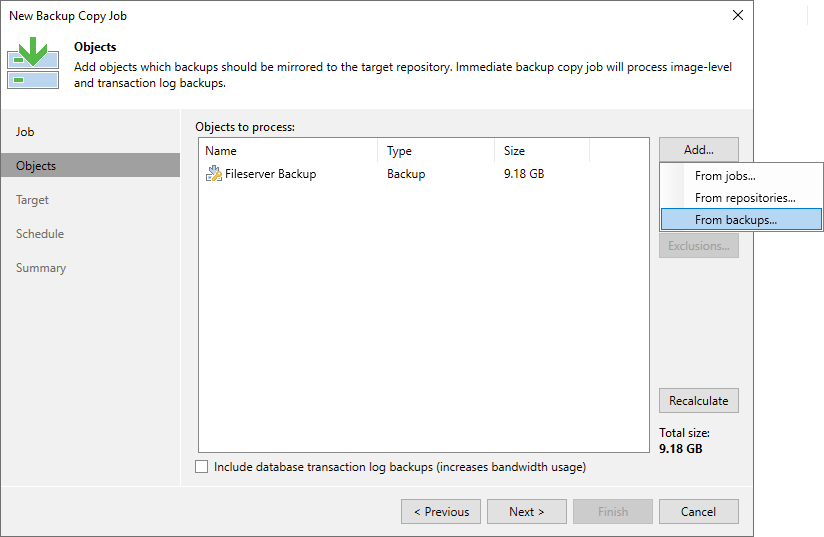

In this article

The SP can configure backup copy jobs for backups of public cloud appliances.

This feature allows the SP to copy backups of cloud appliances to regular backup repositories in the regular Veeam Backup & Replication backup file format. To learn more, see the [Backup Copy](https://helpcenter.veeam.com/docs/vbr/userguide/backup_copy.html?ver=13) section in the Veeam Backup & Replication User Guide.

The SP can configure backup copy jobs for backups created by the following Veeam products:

* [Veeam Backup for AWS](https://helpcenter.veeam.com/docs/vbaws/guide/welcome.html?ver=10)
* [Veeam Backup for Microsoft Azure](https://helpcenter.veeam.com/docs/vbazure/guide/overview.html?ver=8.1)

To start working with those backups, the SP must add the repository that contains backups of Amazon EC2 instances or Azure VMs to the Veeam Backup & Replication infrastructure as an external repository. Then, they can use this external repository as a source backup repository and use a repository on the SP side as a target backup repository for backup copy.

To work with backup copy jobs for Amazon EC2 or Microsoft Azure data, the SP must be able to manage the backup server with Veeam Service Provider Console. For more information, see the [Connect Veeam Cloud Connect Servers to Veeam Service Provider Console](https://helpcenter.veeam.com/docs/vac/deployment/connect_cloud_server.html?ver=9.1) section in the Deployment Guide.

|  |
| --- |
| Note |
| The public cloud appliance must be deployed in the SP backup infrastructure. To do this the SP must use the Veeam Service Provider Console. For details see the following sections:   * For Microsoft Azure, see details in the [Adding Veeam Backup for Microsoft Azure Appliances](https://helpcenter.veeam.com/docs/vac/provider_admin/clouds_add_azure.html?ver=9.1) section in the Guide for Service Providers. * For AWS, see details in the [Adding Veeam Backup for Amazon Web Services Appliances](https://helpcenter.veeam.com/docs/vac/provider_admin/clouds_add_aws.html?ver=9.1) section in the Guide for Service Providers. |

You can restore data from backups created by both backup jobs and backup copy jobs. Restore operations are available directly from the SP Veeam Backup & Replication console. For the complete list of the available operations, see the following sections:

1. [Performing Restore](https://helpcenter.veeam.com/docs/vbazure/guide/performing_restore.html?ver=8.1) in the Veeam Backup for Microsoft Azure User Guide
2. [Performing Restore](https://helpcenter.veeam.com/docs/vbaws/guide/recovery.html?ver=10) in the Veeam Backup for AWS User Guide

Getting Started with Backup Copy for Public Cloud Backups

To start working with backup copy jobs for public cloud backups, you must complete the following tasks:

1. In Veeam Service Provider Console, configure connection to the backup server and the public cloud appliance that contains backups of Amazon EC2 instances or Azure VMs.

* For details on how to connect to the backup server, see the [Connecting Veeam Backup & Replication Servers](https://helpcenter.veeam.com/docs/vac/provider_admin/connect_backup_servers.html?ver=9.1) section in the Guide for Service Providers.
* For details on how to connect to the public cloud appliance, see the [Managing Veeam Backup for Public Clouds Appliances](https://helpcenter.veeam.com/docs/vac/provider_admin/clouds_appliances.html?ver=9.1) section in the Guide for Service Providers.

1. In the Veeam Backup & Replication console, set up credentials for repositories available on the appliance.

1. Launch the wizard to edit a public cloud appliance.

For detailed instructions, see the following sections:

* [For Microsoft Azure] The [Editing Appliance Settings](https://helpcenter.veeam.com/docs/vbazure/guide/editing_appliance_console.html?ver=8.1) section in the Veeam Backup for Microsoft Azure User Guide
* [For AWS] The [Editing Appliance Settings](https://helpcenter.veeam.com/docs/vbaws/guide/edit_appliance.html?ver=10) section in the Veeam Backup for AWS User Guide

1. Specify credentials for repositories available on the appliance.

For detailed instructions, see the following sections:

* [For Microsoft Azure] The [Configure Repository Settings](https://helpcenter.veeam.com/docs/vbazure/guide/adding_appliance_repository.html?ver=8.1) section in the Veeam Backup for Microsoft Azure User Guide
* [For AWS] The [Configure Repository Settings](https://helpcenter.veeam.com/docs/vbaws/guide/connect_appliance_repo.html?ver=10) section in the Veeam Backup for AWS User Guide

1. Backups created for this appliance become available in the SP Veeam Backup & Replication console. To view the backups, do the following:

1. Open the Backup Infrastructure view.
2. In the inventory pane, click External Repositories.
3. In the working area, right-click the cloud repository and select Rescan.

1. Create a backup copy job:

1. Open the Home view.
2. In the inventory pane, click External Repository and select Backup Copy.
3. At the Objects step of the wizard, click Add and select From backups. There you can select any root backup that resides in the external repository.

1. Follow the steps of the new backup copy job wizard and finish it in the same way as regular backup copy job.

To learn more, see [Creating Backup Copy Jobs](cloud_connect_backup_copy.md).

Page updated 11/26/2025

Page content applies to build 13.0.1.1071
