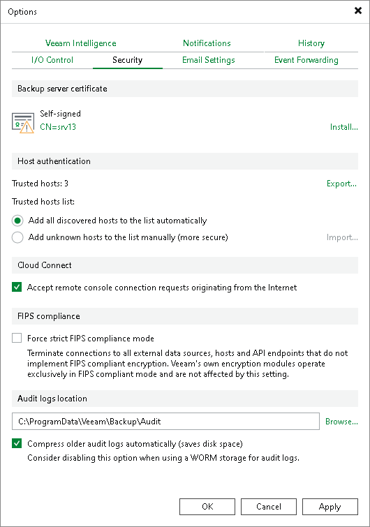

In this article

To query information about tenants whose backup servers are available for remote management, the Remote Access Console needs to connect to the SP backup server. If the Remote Access Console is installed on a remote machine connected to an external network (in the internet), the Remote Access Console will communicate with the SP backup server through the cloud gateway. By default, Veeam Backup & Replication does not accept connections from a Remote Access Console over the internet. The SP can enable this functionality in the Veeam Backup & Replication settings if necessary.

To enable access to the cloud gateway for the Remote Access Console:

1. On the SP Veeam backup server, open the Veeam Backup & Replication console.
2. From the main menu, select Options.
3. Open the Security tab.
4. In the Cloud Connect section, select the Accept remote console connection requests originating from the Internet check box.
5. Click OK.

|  |
| --- |
| Note |
| The Cloud Connect section is available in the Security tab on the SP backup server only, that is, a Veeam backup server on which the Veeam Cloud Connect license is installed. |

Page updated 11/4/2025

Page content applies to build 13.0.1.1071
