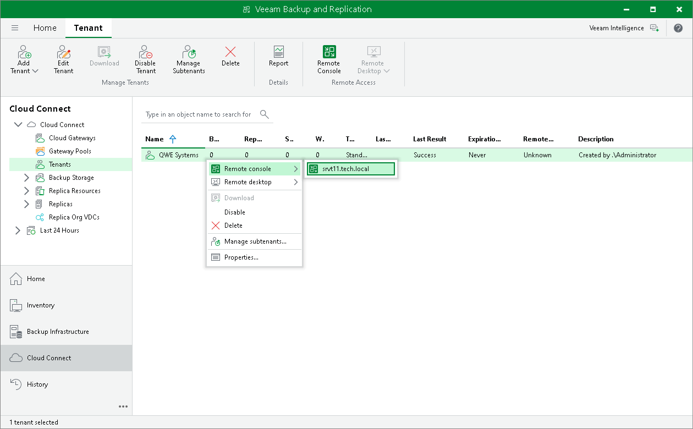

In this article

To connect to the tenant backup server, the SP must open the Remote Access Console. The Remote Access Console is available on the SP backup server or dedicated machine on which the Veeam Backup & Replication is installed.

To open the Remote Access Console, do one of the following:

* Double-click the Veeam Backup & Replication Remote Access Console icon on the desktop (you can use this option only if you want to open the Remote Access Console on the SP backup server).
* Run the following command:

|  |
| --- |
| "%ProgramFiles%\Veeam\Backup and Replication\Console\veeam.backup.shell.exe" -TenantRemoteAccess |

On the SP backup server, the SP can also open the Remote Access Console from the locally installed Veeam Backup & Replication console. In this case, the SP can connect to the backup server of the specific tenant.

To open the Remote Access Console:

1. Open the Cloud Connect view.
2. In the inventory pane, click the Tenants node.
3. Select the tenant in the working area, click Remote Console on the ribbon and select the backup server to which you want to connect or right-click the tenant in the working area, select Remote console and select the backup server to which you want to connect.

Page updated 4/17/2024

Page content applies to build 13.0.1.1071
