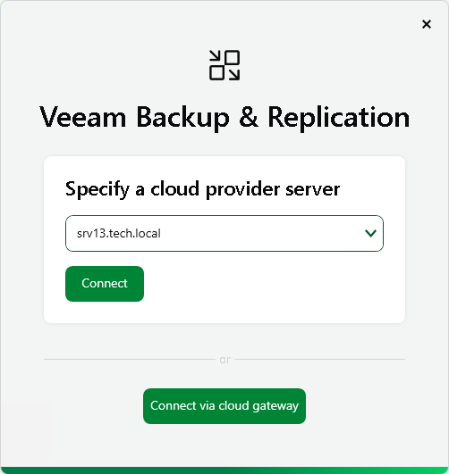
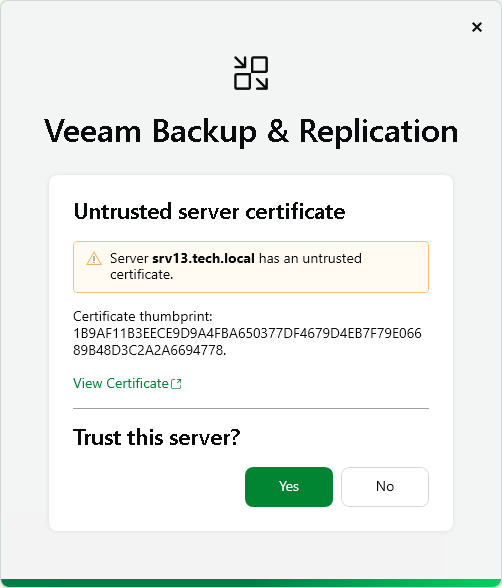
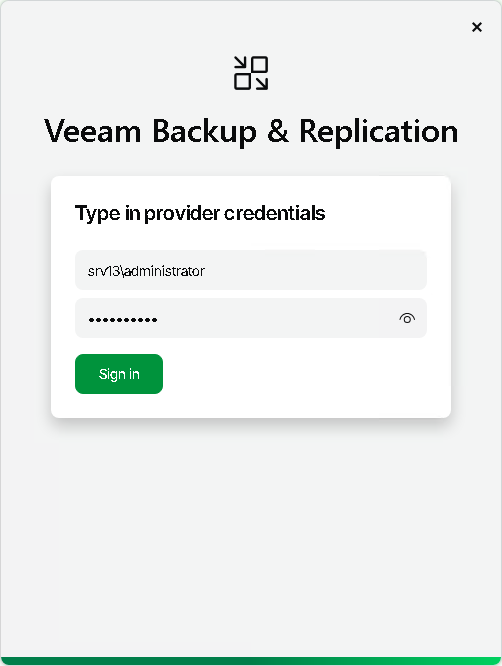
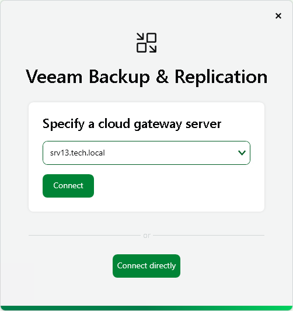

In this article

To query information about currently available tenants and access the Cloud network redirector, the Remote Access Console needs to connect to the SP backup server. You must specify connection settings to access the SP backup server in the Open Remote Access Console dialog window. The process of specifying SP backup server settings differs depending on the Remote Access Console deployment scenario:

* If the Remote Access Console is deployed in the SP Veeam Cloud Connect infrastructure, you must specify settings to connect directly to the SP backup server. To learn more, see [Direct Connection](#direct).
* If the Remote Access Console is deployed on a remote machine in an external network, you must specify settings to connect to the SP backup server through a cloud gateway. To learn more, see [Connection Through Cloud Gateway](#gateway).

Direct Connection

If you open the Remote Access Console on the SP backup server or dedicated machine connected to the SP backup infrastructure network, you must specify settings to connect directly to the SP backup server. To connect to the SP backup server:

1. At the Specify a cloud provider server step, type the name or IP address of the SP backup server or select it from the list of recent connections. Then click Connect.

If you open the Remote Access Console on the SP backup server, by default, the backup server field contains the name of this backup server — localhost.

1. At the Server certificate step, select if you trust the server certificate. Click Yes.

1. At the Type in provider credentials step, enter the user name and password of the account that you want to use to connect to the SP backup server. The user account must have the Veeam Backup Administrator role on the SP backup server.

1. Click Sign in.

You will proceed to the steps to connect to the tenant backup server. For details, see [Connect to Tenant Backup Server](cc_remote_console_tenant.md).

Connection Through Cloud Gateway

If the Remote Access Console is deployed on a remote machine connected to an external network, you must specify settings to connect to the SP backup server from the internet through a cloud gateway. To specify connection settings:

1. At the Specify a cloud provider server step, click Connect via cloud gateway.

1. At the Specify a cloud gateway server step, type the name or IP address of the cloud gateway or select it from the list of recent connections. Then click Connect.

1. At the Type in provider credentials step, enter the user name and password of the account that you want to use to connect to the SP backup server. The user account must have the Veeam Backup Administrator role on the SP backup server.

1. Click Sign in.

You will proceed to the steps to connect to the tenant backup server. For details, see [Connect to Tenant Backup Server](cc_remote_console_tenant.md).

Page updated 11/3/2025

Page content applies to build 13.0.1.1071
