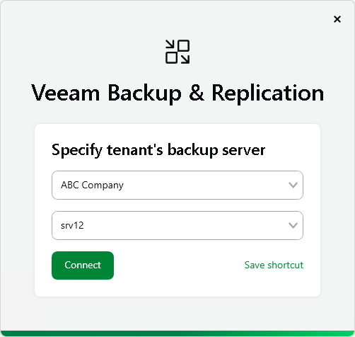
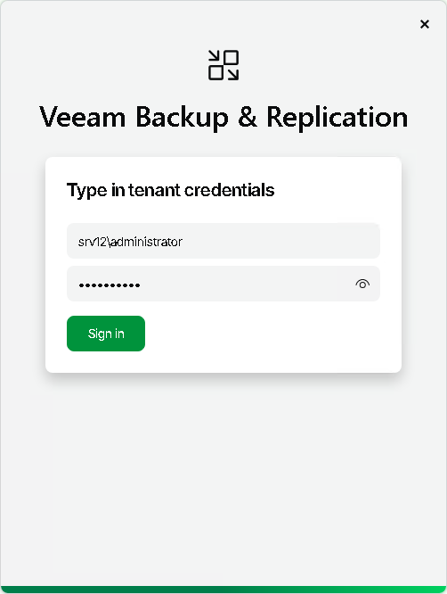

In this article

To log on to Veeam Backup & Replication on the tenant side, you must specify connection settings to access the tenant backup server.

1. At the Specify tenant's backup server step, do the following:

1. From the drop-down list, select the user name of the tenant account to whose backup server you want to connect. Tenants who have opened a control connection to the SP and whose backup servers are available for connection with the Remote Access Console automatically appear in this list.
2. From the drop-down list, select the name of the tenant backup server to which you want to connect. The list contains names of backup servers that belong to the selected tenant and are available for connection with the Remote Access Console.
3. To create a shortcut for the connection, click Save shortcut. You can create as many shortcuts as you need.
4. Click Connect.

1. At the Type in tenant credentials step, enter credentials of the user account that you want to use to connect to the tenant backup server. The user account must have the Veeam Backup Administrator role on the tenant backup server (or other role that allows the user to perform required operations in Veeam Backup & Replication).

1. Click Sign in.

Page updated 11/3/2025

Page content applies to build 13.0.1.1071
