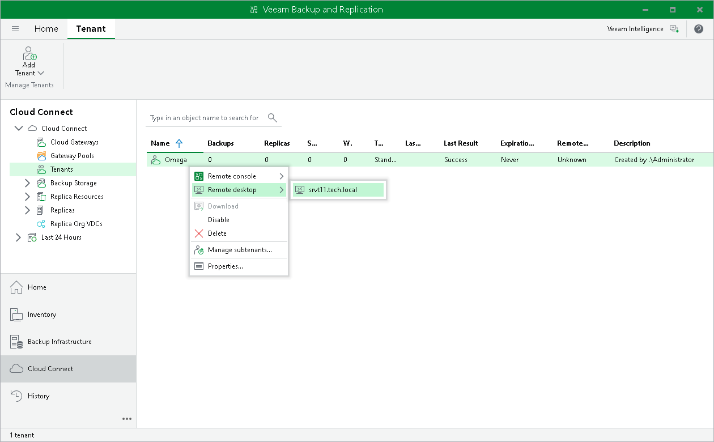
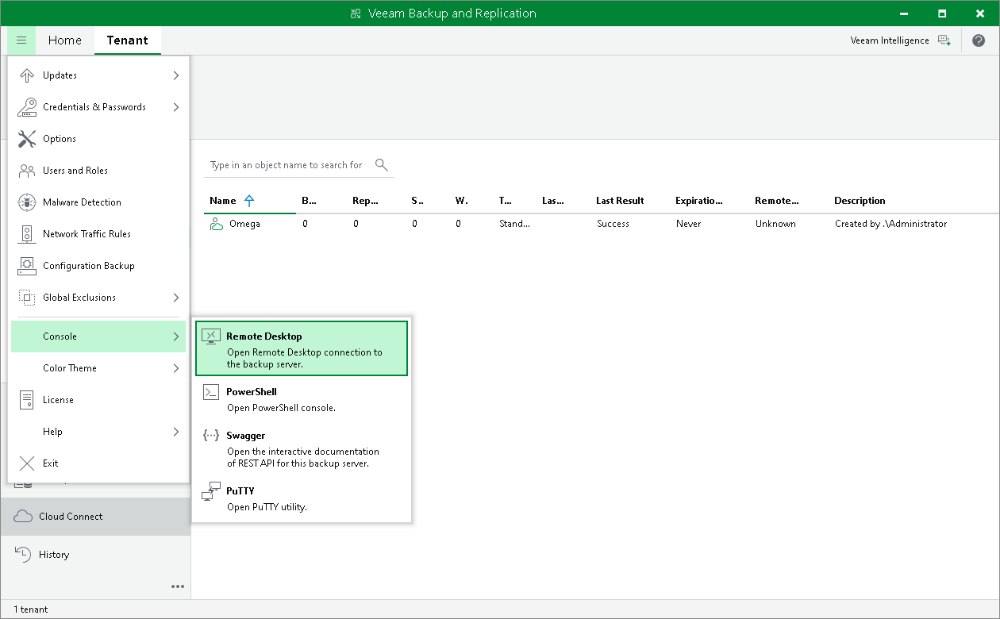

# Launching Remote Desktop Session to Tenant

You can use the Remote Access Console to open a connection to the tenant backup server over the Remote Desktop Protocol. On the machine where the Remote Access Console is installed, Veeam Backup & Replication will launch the Remote Desktop Connection client allowing you to log on to the OS running on the tenant backup server.

Before connecting to the tenant backup server over Remote Desktop Protocol, check the following prerequisites:

* The tenant backup server must run the Microsoft Windows OS.
* The OS running on the tenant backup server must be set up to accept remote desktop connections.

To launch a remote desktop session:

1. Do either of the following:

* In the Veeam Backup & Replication console running on the SP backup server, in the Cloud Connect view, click the Tenants node. Select the necessary tenant in the working area, click Remote Desktop on the ribbon and select the tenant backup server to which you want to connect.
* In the Veeam Backup & Replication console running on the SP backup server, in the Cloud Connect view, click the Tenants node. Right-click the necessary tenant in the working area, select Remote Desktop and select the backup server to which you want to connect.
* In the Open Remote Access Console window, make sure that the Remote Access Console is connected to the SP backup server, press and hold the [CTRL] key and click Connect. Instead of connecting to the tenant backup server with the Remote Access Console, Veeam Backup & Replication will launch the Remote Desktop Connection client.

1. In the Windows Security window, specify credentials to connect to the backup server and click OK. Veeam Backup & Replication will launch the Remote Desktop Connection client and connect to the backup server.

|  |
| --- |
| Tip |
| You can also launch the Remote Desktop Connection client from the main menu of the regular Veeam Backup & Replication console. In this case, Veeam Backup & Replication will open a remote desktop session to the backup server to which this Veeam backup console is currently connected. To learn more, see [Establishing Remote Desktop Connection to Backup Server](#rdp). |

Establishing Remote Desktop Connection to Backup Server

You can start a remote desktop session not only to the tenant backup sever, but also to any backup server to which the Veeam Backup & Replication console is currently connected. To connect to a backup server over Remote Desktop Protocol.

1. In the Veeam Backup & Replication console, make sure that the console is connected to the necessary backup server. You can check the name or IP address of the backup server in the status bar of the Veeam backup console window.
2. In the Main Menu, select Console > Remote Desktop.
3. In the Windows Security window, specify credentials to connect to the backup server and click OK. Veeam Backup & Replication will launch the Remote Desktop Connection client and connect to the backup server.

